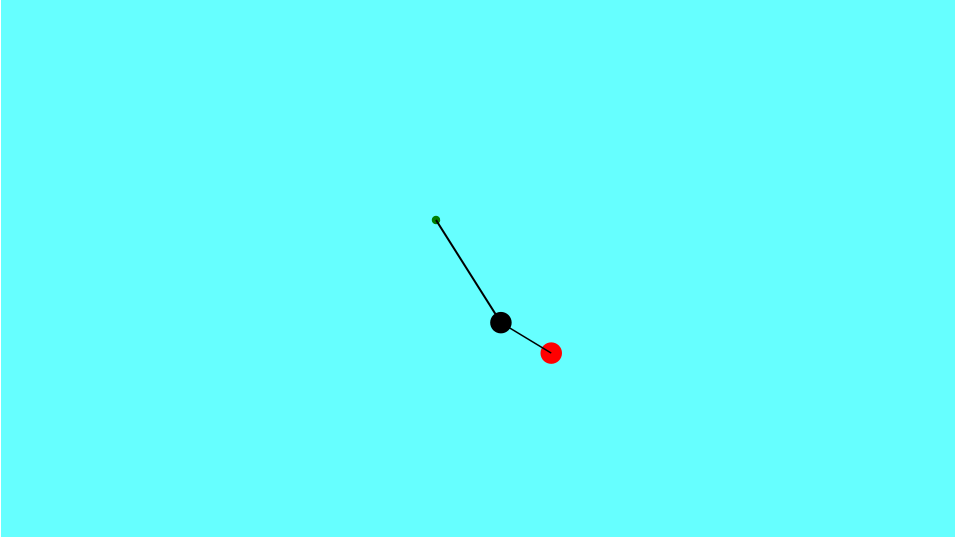

# Dokumente
- [Daten und Lebenslauf](Lebenslauf.md)
- [Abiturzeugnis](CCF18022020_0001.jpg)
- [Semesternotenspiegel](Notenspiegel.pdf)
- [Empfehlungsschreiben](EmpfehlungCalvinDellOro.pdf)
- [Auszeichnung des Gymnasiums für kulturelles Engagement](CCF18022020_0003.jpg")
- [Hackathon-Urkunde](CCF18022020_0002.jpg)
- [Regelung zum praktischen Studiensemester](CCF18022020_0000.jpg)

# Coding-Beispiele  
## Fraktal

## FraktalAnimation

## Cardioids

## RubberBand

# 3D-Modelling Projekte mit Blender
## Turret for Tower-Defense-Game
<video controls width="100%"> 
  <source src="https://www.youtube.com/embed/watch?v=VAOCARtbn54"/>
  <a href="https://www.youtube.com/embed/VAOCARtbn54">Play Video</a>
</video>   

Dies ist mein erstes 3D-Mesh-Modellierungsprojekt, daher wird in diesem Video teilweise unerfahrener Workflow wiedergegeben. Die Idee dazu kam mir, als ich einem Kollegen beim Programmieren eines 3D-Tower-Defense Spiels zuschaute.  
Abgesehen von dem Kugellager und den Läufen, bediente ich mich keinen Tutorials, um die Modelliertechniken herauszufinden, da ich ein möglichst individualisiertes Gatling-Geschütz erschaffen wollte. Ich verwendete hier alle elementaren Tools, die der Edit-Mode von Blender für Hard-Surface-Modeling zu bieten hat.  
Das Endresultat ist in dem Tower-Defense-Game meines Kollegen integriert

            <h3>Eine Truhe</h3>
            
            

                <i>Dieses Projekt geht aus einer Computergrafik-Aufgabe hervor, deren Anforderung das Modellieren (Mesh
                    ohne Material) einer symmetrischen Truhe, mitsamt eines Deckels und eines Rahmens war.  
                    Ich ging darüber hinaus, in dem ich aus der primitiven Geometrie Details wie Edelsteine durch
                    Loop-Cuts, Extrudes und Insets erzeugte. Die Marmortexturen erzeugte ich prozedural über
                    Noise-Nodes, die Holztextur ebenso über Noise, Musgrave und Voronoi Nodes, sowie Vektorkurven und
                    Color-Burn-Nodes.</i>
            

            <h3>Und dessen Schloss</h3>
            
            

                <i>Die Anforderung für das Schloss war, aus einem größeren Würfel einen kleineren durch Insets oder dem
                    boolean-Modifier auszustanzen  
                    um einen höheren Detailgrad zu erreichen, modellierte ich mit Bézierkurven eine etwas aufwendigere
                    Ausstanzform für ein Schloss. Hier generierte ich die prozedurale Textur ebenfalls über die
                    Steuerung der Normalenlänge auf der Oberfläche mittels eines mit Noise-Texturen angesteuerten
                    Bump-Nodes(Displacements)</i>
            

            <h3>Eine Wackelpudding-Simulation <small></small></h3>
            <video height="390" controls loop>
                <source src="Jelly.mp4" alt="Jelly" type="video/mp4">
                Ihr Browser unterstützt den Video-Tag nicht
            </video>
            

                <i>Hier habe ich weniger gemodelt, sondern eher aus freihen Stücken die Möglichkeiten der
                    Softbody&Collision Physik Simulation ausprobiert, und eine kleine Animation gerendert, um ein
                    Wackelpudding-ähnliches Verhalten zu simulieren</i>
            

            <h3>Ein verrücktes U-Boot</h3>
            <video height="390" controls loop>
                <source src="submarine.mp4" alt="submarine" type="video/mp4">
                Ihr Browser unterstützt den Video-Tag nicht
            </video>
            

                <i>Die Anforderungen der Computergrafik-Aufgabe, die mich zu dieser Animation inspirierte, bestand
                    darin, rein durch Skalierung, Rotation und Verschiebung von Objekten, sowie das Anwenden einfacher
                    Materialien ein U-Boot zusammenzustellen. Der "Regel", nur mit der Komposition primitiver Körper zu
                    arbeiten widersetzte ich mich nicht, sondern nahm es als Herausforderung. 
                    Die Positionierung der Spirale aus Blasen erreichte ich durch Rotation langer Blasenreihen unter
                    Proportionalem Bearbeiten. Ähnlich erreichte ich auch die Greifarme des U-Boots.  
                    Die Textur der Blasen erreichte ich durch die Mischung einer Noise-Textur und Transparenz. Die
                    Volumetrische Beleuchtung erreichte ich durch die Addition eines Lichtstreuenden, und eines
                    Licht-Absorbierenden Shaders mit unterschiedlicher Dichte. 
                    Die Bewegungsabläufe erreichte ich durch Keyframes und interpolierten Kurven.
                     
                    Dies war mein erstes Modellierungsprojekt mit einer zeitlich beschränkten Vorgabe</i>
            

            <h3>
                Ein Schild
            </h3>
            
            

                <i>Die Grundidee für diesen Schild ist der Vorarbeitung eines Computergrafik-Vorlesungsskriptes, welches
                    nun allerdings ersetzt wurde, zu verdanken. Hier hätte die Anforderung aus dem Modellieren eines
                    Schildes, und dem Ausschneiden von Bereichen mit dem Boolean-Modifier bestanden.  
                    Ich ging durch die Modellierung komplexerer Details, sowie frei gestaltete Verzierungen durch
                    Bézierkurven hinaus. Auch hier verwendete ich Kombinationen aus Noise-Texturen, um detaillierte
                    Shader zu erreichen</i>
            

            <h3>
                Ein Korallenriff
            </h3>
            <video height="390" controls loop>
                <source src="CoralReef.mp4" alt="CoralReef">
                Ihr Browser unterstützt das Videoformat nicht
            </video>
            

                <i>Dieses Projekt geht aus der aktuellsten Computergrafik-Aufgabe hervor. Das Modeling erfolgte über die
                    Extrudierung eines "Control-Cage", auf dem der Catmull-Clark Algorithmus angewendet wurde Allerdings
                    wurden auch hier keine Materialien gefordert, sondern der Umgang mit dem Displacement-Modifier
                    verinnerlicht werden. 
                    Diesen ersetzte ich durch einen entsprechenden Displacement-Node, durch den ich nicht nur
                    Oberflächenberechnungen der Versetzten Stellen verändern kann, um beispielsweise unterschiedliche
                    Farben oder Rauigkeitswerte zu erreichen, sondern auch generell mehr Kombinations- und
                    Steuerungsmöglichkeiten durch weitere Nodes, wie beispielsweise Noise-Nodes hatte.
                </i>
            

            <h3>
                Ein Donut
            </h3>
            
            

                <i>Dies ist mein Ergebnis des zweiten Levels der Blender-Tutorialreihe des <a
                        href="https://www.youtube.com/watch?v=TPrnSACiTJ4">Blender Guru</a>s. Das durch proportionales
                    Editieren und Scultping erreichte Mesh des Teigs wurde durch Noise-Texturen und Overlay-Variation
                    mit Bump versehen und geshaded, sowie Texture-Painting angewandt, um leicht verbrannte Stellen zu
                    malen 
                    In der Tutorial Reihe wird eine Zuckerglasur verwendet, ich jedoch erwünschte mir eine
                    Schokoladenglasur, die ich durch ein Node-Setup, in dem ein Glossy- und Diffuse Shader gemischt
                    werden, erreichte. Auch hier ist etwas Displacement durch eine Noise-Textur meinerseits verwendet
                    worden.</i>
            

            <h3>
                Ein brennender Affenkopf
            </h3>
            <video height="390" controls loop>
                <source src="Monkey.mp4" alt="Monkey">
                Ihr Browser unterstützt das Videoformat nicht
            </video>
            

                <i>Dies ist mein erstes Blender Projekt überhaupt. In diesem Erfahrungszustand hatte ich noch nie
                    Topologie verändert, und somit für eine Mantaflow Feuer&Rauch-Simulation den vorgefertigten
                    Affenkopf "Suzanne" verwendet, und eine Animation gerendert. Die Position der einzelnen Flammen wird
                    durch eine Wolken-Textur über das Objekt bewegt, um einen höheren Grad an Zufall zu erreichen.
                    Ein brennender Affenkopf kommt in dem Donut-Tutorial des <a
                        href="https://www.youtube.com/watch?v=TPrnSACiTJ4">Blender Guru</a>s ganz zu Beginn vor,
                    allerdings gab es zu der Entstehungszeit Mantaflow noch nicht. Er demonstrierte das Feuer, um
                    Motivation für Blender zu schaffen. Dieser Teil der ersten Folge war mit Mantaflow allerdings nicht
                    nachahmbar, was mich nicht zum Aufgeben, sondern eigenständigem Nachforschen und Ausprobieren
                    ermutigte, bis ich einen brennenden Affenkopf erhielt.
                </i>
            

            <h2 id="video">Video</h2>
            
Cardioids - Tutorial
<iframe width="454" height="255" src="https://www.youtube.com/embed/A68-juE2ves"
                frameborder="0" allow="accelerometer; autoplay; encrypted-media; gyroscope; picture-in-picture"
                allowfullscreen></iframe>
            <h2 id="musik">Musik</h2>
            

                Fuwashima
                (Soundtrack zum GlobalGameJam2020) 
                <audio controls>
                    <source src="Musik/Fuwashima.mp3" type="audio/mp3">
                    Ihr Browser unterstützt den Audio-Tag nicht
                </audio> 
                PiSong  
                <audio controls>
                    <source src="Musik/PiSong.mp3" type="audio/mp3">
                    Ihr Browser unterstützt den Audio-Tag nicht
                </audio>  
                VocalRemixTrap  
                <audio controls>
                    <source src="Musik/VocalRemixTrap.mp3" type="audio/mp3">
                    Ihr Browser unterstützt den Audio-Tag nicht
                </audio>

            <h2 id="grafik">Grafik</h2>
            

                Donald Trump, Kugelschreiberzeichnung  
                  
                Schlafend im Bus, Kugelschreiberzeichnung  
                 
                Tribal, Tuschezeichnung 
                 
                <h1 id="erfahrung">Erfahrung</h1>
                
Seit mein Vater, ein Professor für Computerspiele, mich bereits in sehr frühem Alter von 3 Jahren
                    vorsichtig an dieses Medium herangeführt hat, interessierte ich mich nicht nur für das Spielen,
                    sondern
                    auch ähnlich stark für die Entwicklung von Games. Ich zeichnete zusätzliche Level für Super
                    Mario
                    oder
                    entwarf neue Spiele, das könnte man als meine ersten Schritte im Gamedesign bezeichnen. Später
                    verbrachte ich viel Zeit mit der Kombination der elementaren Redstone-Elemente von Minecraft um
                    logische
                    Schaltungen, Rechensysteme, Binärzähler und Segmentanzeigen zu konstruieren. Auch bereitete mir
                    die
                    Modifikation des Spiels durch selbst gestaltete Resourcepacks viel Freude.

                
Im Alter von 9 Jahren begann mein Interesse am 3D–Modelling, was sich durch Architektur-Projekte
                    in
                    Google SketchUp und diverses Modeling in Sculpt3D wiederspiegelte. Mit 10 Jahren folgten
                    kleinere
                    Text-Games, die ich mit Batch – meiner ersten Programmiersprache - und dem Windows Editor
                    umsetzte.
                    Mit
                    einem Leuchtturm von Fischer-Technik machte ich zu dieser Zeit auch erste Erfahrungen mit
                    Ablaufsteuerungen. Am Nintendo-DS erstellte ich Zeichentrickanimationen über das Touchpad und
                    kleine
                    Stop-Motion-Trickfilme. Mit 11 Jahren begann ich mit der grafischen Bildbearbeitung mit Paint,
                    mit
                    13
                    Jahren intensivierte ich dieses Hobby mit GIMP.

                
Etwa zur selben Zeit befreite mich TypeScript aus der Unflexibilität von Batch, was mir die
                    dynamische
                    Generierung zweidimensionaler Bilder auf einem Canvas ermöglichte. Im Rahmen des mehrmals
                    besuchten
                    Kinder-Uni Feriencamps in Furtwangen machte ich erste Erfahrungen mit Processing und
                    programmierte
                    Pong.
                    Jedes Erlernen eines neuen programmiertechnischen Werkzeuges verstärkte die Erkenntnis der
                    Möglichkeit,
                    dadurch meine Ideen in einem digitalem Medium festzuhalten, und sie von mir oder anderen,
                    interaktiv
                    oder passiv, später wieder abrufbar zu machen, was wiederum meine Motivation immer weiter
                    steigen
                    ließ.
                    Auch begann ich, elektronische Musik mit FL-Studio zu produzieren, oft mit dem Hintergedanken,
                    diese
                    für
                    Computerspiele zu verwenden.

                
Ich erkannte durch die Programmierung die Relevanz der Mathematik in verschiedenen Bereichen und
                    begann
                    mit experimenteller Programmierung für verschiedene Fächer am technischen Gymnasium, wo auch
                    meine
                    erste
                    formale Ausbildung in Informatik begann. Mit 15 Jahren entwickelte ich eine regelrechte
                    Begeisterung
                    für
                    die Möglichkeiten der Vektorrechnung und fraktaler Geometrie. Zusammen mit einem Lehrer und
                    einem
                    Mitschüler, mit dem ich einen Übersetzer für eine ausgedachte Geheimsprache programmierte,
                    gründete
                    ich
                    eine Informatik-AG. In dieser wagten wir uns an die voll umfassende Programmierung neuronaler
                    Netzwerke
                    zum Experimentieren mit künstlicher Intelligenz, besonders bezogen auf Echtzeit -
                    Bildverarbeitung
                    eines
                    Live-Kamerabildes.

                
Im Rahmen der freiwilligen Aufgaben des Programmieren-Moduls meines aktuellen Studiums
                    entwickelte
                    ich
                    mit Java einen ewigen Kalender und Tic-Tac-Toe. Letzteres baute ich zusätzlich mit einem
                    zufällig
                    spielenden Computergegner aus, der zum Trainieren einer künstlichen Intelligenz genutzt werden
                    soll.
                    Beim GlobalGameJam 2020 im Spiellabor der Hochschule wirkte ich in einem Team bei der
                    Entwicklung
                    eines
                    VR-Spiels mit, wobei meine Hauptaufgaben bei Gamedesign und Sound lagen. Dieses Event weckte bei
                    mir
                    erneut die Interesse an der 3D-Programmierung und dem 3D-Modeling, weshalb ich mich momentan in
                    Unity
                    und Blender weiter vertiefe.

        </section>

        <footer>
            
                

                    
this project by <a href="https://github.com/CalvinDO">CalvinDO</a> can be found on <a
                            href="https://github.com/CalvinDO/Bewerbung">GitHub</a>

                
                
                
            
            
Generated with <a href="https://pages.github.com">GitHub Pages</a> using Merlot

            
        </footer>

    

</body>

</html>
