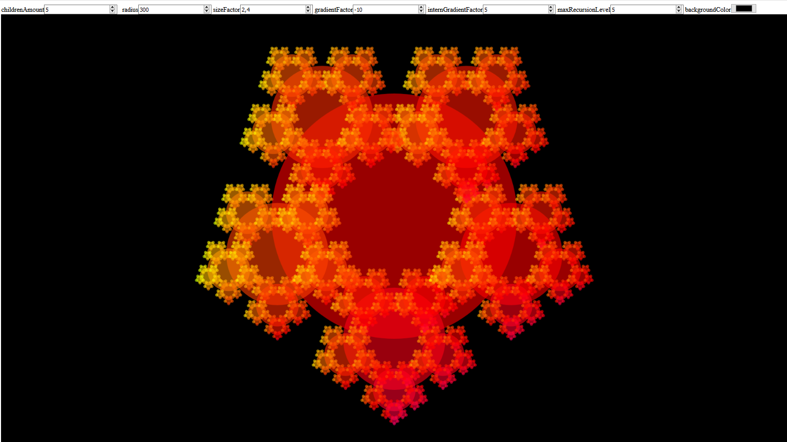
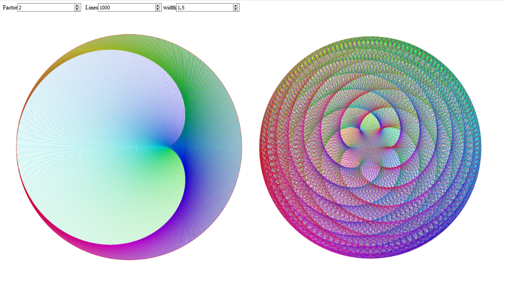

# Inhaltsverzeichnis
- [Motivation](#motivation)
- [Coding](#coding)
- [Modelling](#modelling)
- [Video](#video)
- [Musik](#musik)
- [Grafik](#grafik)
- [Dokumente](#dokumente)

  

  

# Motivation
Seit mein Vater, ein Professor für Computerspiele, mich bereits in sehr frühem Alter von 3 Jahren vorsichtig an dieses Medium herangeführt hat, interessierte ich mich nicht nur für das Spielen, sondern auch ähnlich stark für die Entwicklung von Games. Ich zeichnete zusätzliche Level für Super Mario oder entwarf neue Spiele, das könnte man als meine ersten Schritte im Gamedesign bezeichnen. Später verbrachte ich viel Zeit mit der Kombination der elementaren Redstone-Elemente von Minecraft um logische Schaltungen, Rechensysteme, Binärzähler und Segmentanzeigen zu konstruieren. Auch bereitete mir die Modifikation des Spiels durch selbst gestaltete Resourcepacks viel Freude.  

Im Alter von 9 Jahren begann mein Interesse am 3D–Modelling, was sich durch Architektur-Projekte in Google SketchUp und diverses Modeling in Sculpt3D wiederspiegelte. Mit 10 Jahren folgten kleinere Text-Games, die ich mit Batch – meiner ersten Programmiersprache - und dem Windows Editor umsetzte. Mit einem Leuchtturm von Fischer-Technik machte ich zu dieser Zeit auch erste Erfahrungen mit Ablaufsteuerungen. Am Nintendo-DS erstellte ich Zeichentrickanimationen über das Touchpad und kleine Stop-Motion-Trickfilme. Mit 11 Jahren begann ich mit der grafischen Bildbearbeitung mit Paint, mit 13 Jahren intensivierte ich dieses Hobby mit GIMP.  

Etwa zur selben Zeit befreite mich TypeScript aus der Unflexibilität von Batch, was mir die dynamische Generierung zweidimensionaler Bilder auf einem Canvas ermöglichte. Im Rahmen des mehrmals besuchten Kinder-Uni Feriencamps in Furtwangen machte ich erste Erfahrungen mit Processing und programmierte Pong. Jedes Erlernen eines neuen programmiertechnischen Werkzeuges verstärkte die Erkenntnis der Möglichkeit, dadurch meine Ideen in einem digitalem Medium festzuhalten, und sie von mir oder anderen, interaktiv oder passiv, später wieder abrufbar zu machen, was wiederum meine Motivation immer weiter steigen ließ.  

Auch begann ich, elektronische Musik mit FL-Studio zu produzieren, oft mit dem Hintergedanken, diese für Computerspiele zu verwenden.  

Ich erkannte durch die Programmierung die Relevanz der Mathematik in verschiedenen Bereichen und begann mit experimenteller Programmierung für verschiedene Fächer am technischen Gymnasium, wo auch meine erste formale Ausbildung in Informatik begann. Mit 15 Jahren entwickelte ich eine regelrechte Begeisterung für die Möglichkeiten der Vektorrechnung und fraktaler Geometrie. Zusammen mit einem Lehrer und einem Mitschüler, mit dem ich einen Übersetzer für eine ausgedachte Geheimsprache programmierte, gründete ich eine Informatik-AG. In dieser wagten wir uns an die voll umfassende Programmierung neuronaler Netzwerke zum Experimentieren mit künstlicher Intelligenz, besonders bezogen auf Echtzeit-Bildverarbeitung eines Live-Kamerabildes.  

Im Rahmen der freiwilligen Aufgaben des Programmieren-Moduls meines aktuellen Studiums entwickelte ich mit Java einen ewigen Kalender, Game-Of-Life und Tic-Tac-Toe. Letzteres baute ich zusätzlich mit einem zufällig spielenden Computergegner aus, der zum Trainieren einer künstlichen Intelligenz genutzt werden soll.  

Beim GlobalGameJam 2020 im Spiellabor der Hochschule wirkte ich in einem Team bei der Entwicklung eines VR-Spiels mit, wobei meine Hauptaufgaben bei Gamedesign und Sound lagen. Dieses Event weckte bei mir erneut die Interesse an der 3D-Programmierung und dem 3D-Modeling, weshalb ich mich in Unity und Blender weiter vertiefte.  

Seit Oktober 2019 studierte ich 7 Semester lang Medieninformatik an der Hochschule Furtwangen, und schloss mit dem Bachelor of Science ab. Nach dem ersten Semester erhielt ich von meinen Professoren für Mathematik und Informatik Anfragen als Tutor tätig zu werden, und war als solcher für das Modul "Programmierung" eingestellt. Ich beendete das zweite Semester mit einer 360°-Panorama-Verkörperung der Schnitzeljagd an der Hochschule Furtwangen, sowie einer Eisladen-Website mit Server, realisiert als Browsergame. Das Praktikum als drittes Semester absolvierte ich bei "weltenbauer. Software Entwicklung GmbH", wo ich am Bau-Simulator im Developer-Team mitarbeitete. Das Unternehmen behielt mich gleich als Werkstudent, bis zur Abgabe der Thesis. Im vierten und fünften Semester, dem Projektstudium, entwickelte ich in einem sechsköpfigen Team aus engagierten Studenten das tiefgründige psychologische Horror-Spiel "Morbus-Animi", das den ersten Platz der IndieNight-Nominierung gewann. Im sechsten Semester folgten Spiele wie "TheLastHope", einem Rouge-like nach H.P. Lovecraft, entwickelt mit fünf anderen talentierten Studenten, oder "BeerPhong", einer mobilen browserbasierten AR-Version des berühmten Partyspiels. Ich schloss das Studium mit meiner Bachelor-Thesis "Neuroevolution benutzerdefinierter mehrbeiniger Kreaturen" ab, bei dem in einem Editor Knochen-Gelenk-Konstruktionen erstellt werden, die durch Mutationen über Generationen hinweg Laufmuster von Grund auf lernen.
Auf dieser Seite sammle ich einige meiner Arbeiten, um einen Beleg für meinen Enthusiasmus und Lernfähigkeit zu liefern und Interesse für ein Angebot zu wecken.

  

  

# Coding

## Eisladen
  
asdfadsf

## Baumgenerator
  
Diesen parametrisierten Baumgenerator als Blender-Addon entwickelte ich in einem Team, bestehend aus einem weiteren Programmierer und Grafiker, der die Blätter und die Rinde der Bäume entwarf. Benutzer können in dem Tooltip die Anzahl der Ast-Abspaltungen, die Ausrichtungsstärke gen Himmel und den Radius einstellen. Auch rekursive Parameter eines jeden Astes zu seinem auswachsenden Ast sind einstellbar, Verkürzung der Länge und des Radius', Änderung der Verkürzung der Winkel und Zufallsabweichung. Nach Import der "Addon.py"-Datei finden Sie einen "Generate Tree"-Button im Scene-Tab des Property-Windows.  
Bei der objektorientierten Programmierung lernte ich die Rodrigues-Rotationsformel kennen und wandte andere Vektorrechnung wie das Kreuzprodukt an. Auch mit Blender-eigenen Umgebungsvariablen und Methoden machte ich mich vertraut. Die Instanzierung der Astaustriebe ähnelt dem Projekt [Fraktal](#fraktal)  
Die Programmierung erfolgte im fünften Semester im Rahmen des Kurses -- Name --

## Fraktal
  
Die Idee für diese Applikation kam mir auf, als ich die Möglichkeiten der grafischen Visualisierung durch Rekursion begriff. Das klare Endergebnis konnte ich mir, je nach Anzahl von Iterationen, noch nicht vorstellen, weshalb ich es sofort ausprobierte, mit dem Ziel, mich von meinem eigenen Programm zum Staunen zu bewegen.  
Instanzierte Bälle mit "create-children" Objektmethoden schafften dies bereits. Es folgten einige Experimente mit der maximal umsetzbaren Auflösung verschiedener Browser, um ein fertig gerendertes Bild von 10000 mal 10000 Pixeln zu erhalten, welches sich stark vergrößern lässt, um die repetitiven Strukturen nahtlos entdecken zu können.  
Daraufhin, ebenfalls ohne eine konkrete Vorstellung des Ergebnisses, begann ich den Farbwinkel abhängig von der Iterationsstufe und der Ordnung der zirkular positionierten Kreise sowohl relativ, als auch absolut zu berechnen. Auch hier war ich von der Ästhetik der visualisierten Mathematik überrascht und begeistert.  
Auf der Seite können Sie einige Parameter der Berechnung verändern.

## FraktalAnimation
  
Zugrunde liegt das zuvor beschriebene Projekt "Fraktal". Diesmal mit dem Ziel, einige Parameter der Berechnung, die sich als Dezimalbrüche darstellen lassen, wie beispielsweise der Farbwinkel, zeitlich zu modulieren, um eine zusätzliche Dimension zu schaffen, die ebenso zu etlichen neuen Beobachtungen und weiteren Experimenten führen sollte.  
Bemerkenswert ist unter anderem der Zusammenhang, wie sich die Veränderung des Divisors eines Vollkreises, der die Positionierung der "children" eines jeden Balls bestimmt, auf die Bewegung und das Muster der Anordnung bis hin zu den kleinsten Bällen auswirkt, ebenso wie die entstehende Farbkonstellation

## Cardioids
  
Dieses Projekt ist durch eine Präsentationsarbeit im Fach Mathematik der 13. Klasse entstanden. Meine Mitschüler und ich durften uns entweder aus vorgegebenen, oder eigens ausgesuchten fortgeschrittenen Themen der Mathematik widmen. Für letzteres wählte ich aus meiner schon bestehenden Kenntnis einiger mathematischer/physikalischer Phänomene die der Kardioide aus.  
Um die Beschreibung der dahinter liegenden Mathematik zu vermeiden, verweise ich an dieser Stelle auf das Endresultat innerhalb des Mathematik-Projekts, welches aus diesem vertonten [Video](#video) bestand.   
Um den Mitschülern die Thematik näher zu bringen und dafür zu faszinieren, programmierte ich diese Anwendung. Bei höheren Werten des in der Applikation auch von Ihnen einstellbaren Parameters "Faktor", sowie dem ab dann interressanten Parameter "Lines", ist für mich bis heute der eindeutige Zusammenhang der eingestellten Werte mit den entstehenden Mustern zugegebenermaßen nicht eindeutig erklärbar.

## RubberBand
  
Grundlage für diese Physik-Simulation war die in Echtzeit stattfindende Anwendung physikalischem Verhaltens auf Körper, die von dem Mauszeiger beeinflusst werden. Durch simple Vektoradition erschuf ich damit schon ein System dreier gekoppelter Massen, deren Verhalten annähernd Gummibändern ähneln.  
Hieraus wird sich in naher Zukunft noch eine Simulation eines ganzen Rasters dieser Massen entwickeln, um Stoff zu simulieren (Cloth-Simulation).

  

  

# Modelling                   
## Turret for Tower-Defense-Game
<iframe width="100%" height="300em" src="https://www.youtube.com/embed/VAOCARtbn54"
frameborder="0" allow="accelerometer; autoplay; encrypted-media; gyroscope; picture-in-picture" allowfullscreen>
</iframe>  
Dies ist mein erstes 3D-Mesh-Modellierungsprojekt, daher wird in diesem Video teilweise unerfahrener Workflow wiedergegeben. Die Idee dazu kam mir, als ich einem Kollegen beim Programmieren eines 3D-Tower-Defense Spiels zuschaute.  
Abgesehen von dem Kugellager und den Läufen, bediente ich mich keines Tutorials, um die Modelliertechniken herauszufinden, da ich ein möglichst individualisiertes Gatling-Geschütz erschaffen wollte. Ich verwendete hier alle elementaren Tools, die der Edit-Mode von Blender für Hard-Surface-Modeling zu bieten hat.  
Das Endresultat ist in dem Tower-Defense-Game meines Kollegen integriert

## Truhe
  
Dieses Projekt geht aus einer Computergrafik-Aufgabe hervor, deren Anforderung die Modellierung (Mesh ohne Material) einer symmetrischen Truhe, mitsamt eines Deckels und eines Rahmens war.  
Ich ging darüber hinaus, in dem ich aus der primitiven Geometrie Details wie Edelsteine durch Loop-Cuts, Extrudes und Insets erzeugte. Die Marmortexturen erzeugte ich prozedural über Noise-Nodes, die Holztextur ebenso über Noise, Musgrave und Voronoi Nodes, sowie Vektorkurven und Color-Burn-Nodes. 

## Deren Schloss
  
Die Anforderung für das Schloss war, aus einem größeren Würfel einen kleineren durch Insets oder dem boolean-Modifier auszustanzen.  
Um einen höheren Detailgrad zu erreichen, modellierte ich mit Bézierkurven eine etwas aufwendigere Ausstanzform für ein Schloss. Hier generierte ich die prozedurale Textur ebenfalls über die Steuerung der Normalenlänge auf der Oberfläche mittels eines mit Noise-Texturen angesteuerten Bump-Nodes (Displacements)

## Wackelpudding-Simulation  
<video width="100%" controls loop>
            <source src="Jelly.mp4" alt="Jelly" type="video/mp4"/>
            Ihr Browser unterstützt den Video-Tag nicht
</video>  
Hier habe ich weniger gemodelt, sondern eher aus freien Stücken die Möglichkeiten der "Softbody & Collision"-Physiksimulation ausprobiert, und eine kleine Animation gerendert, um ein Verhalten zu simulieren, das Wackelpudding ähnelt.
  
## Das verrückte U-Boot  
<video width="100%" controls loop>
            <source src="submarine.mp4" alt="submarine" type="video/mp4">
            Ihr Browser unterstützt den Video-Tag nicht
</video>  
Die Anforderungen der Computergrafik-Aufgabe, die mich zu dieser Animation inspirierte, bestand darin, rein durch Skalierung, Rotation und Verschiebung von Objekten, sowie die Anwendung einfacher Materialien ein U-Boot zusammenzustellen. Der Anforderung, nur mit der Komposition primitiver Körper zu arbeiten, widersetzte ich mich nicht sondern nahm sie als Herausforderung an.  
Die Positionierung der Spirale aus Blasen erreichte ich durch Rotation langer Blasenreihen unter proportionalem Bearbeiten. Ähnlich erschuf ich auch die Greifarme des U-Boots. Die Textur der Blasen gestaltete ich durch die Mischung einer Noise-Textur und Transparenz. Die volumetrische Beleuchtung erreichte ich durch die Addition eines lichtstreuenden, und eines licht-Absorbierenden Shaders mit unterschiedlicher Dichte. Die Bewegungsabläufe erreichte ich durch Keyframes und interpolierten Kurven. Dies war mein erstes Modellierungsprojekt mit einer zeitlich beschränkten Vorgabe.

## Schild   
<video width="100%" controls loop>
            <source src="SchildWater.mp4" alt="SchildWater">
            Ihr Browser unterstützt das Videoformat nicht
</video>
Die Grundidee für diesen Schild ist der Vorarbeitung eines Computergrafik-Vorlesungsskriptes, welches nun allerdings ersetzt wurde, zu verdanken. Hier hätte die Anforderung aus dem Modellieren eines Schildes, und dem Ausschneiden von Bereichen mit dem Boolean-Modifier bestanden.  
Ich ging durch die Modellierung komplexerer Details, sowie frei gestaltete Verzierungen durch Bézierkurven darüber hinaus. Auch hier verwendete ich Kombinationen aus Noise-Texturen, um detaillierte Shader zu erreichen. Die Animation ermöglichte mir die Mantaflow-Fluidsimulation. Hier benutze ich ebenso für das Wasser, als auch für die Schaum, Sprüh, Blasen und Fluid-Partikel einzelne Shader, die ich durch Node-Setups erreichte. Für das Wasser bestimmte ich die Mischung von einem "Diffuse"- und "Glossy"-Shader mit dem "Fresnel"-Linseneffekt, mischte dies mit einem "Glass"-Shader, und dies wiederrum mit mit einem "Transparent"-Shader. Für die anderen Partikel wurden die Mischungsverhältnisse der Shader verändert, oder mit dem zuvor genannten "Blasen-Node-Setup" kombiniert.  

## Korallenriff  
<video width="100%" controls loop>
            <source src="CoralReef.mp4" alt="CoralReef">
            Ihr Browser unterstützt das Videoformat nicht
</video>
Dieses Projekt geht aus der aktuellsten Computergrafik-Aufgabe hervor. Das Modeling erfolgte über die Extrusion eines "Control-Cage", auf dem der Catmull-Clark-Algorithmus angewendet wurde Allerdings wurden auch hier keine Materialien gefordert, sondern es sollte der Umgang mit dem Displacement-Modifier verinnerlicht werden.  
Diesen ersetzte ich durch einen entsprechenden Displacement-Node, durch den ich nicht nur Oberflächenberechnungen der versetzten Stellen verändern kann, um beispielsweise unterschiedliche Farben oder Rauigkeitswerte zu erreichen, sondern auch generell mehr Kombinations- und Steuerungsmöglichkeiten durch weitere Nodes, wie beispielsweise Noise-Nodes, hatte.

## Donut
  
Dies ist mein Ergebnis des zweiten Levels der Blender-Tutorialreihe des <a href="https://www.youtube.com/watch?v=TPrnSACiTJ4">Blender Guru</a>s. Das durch proportionales Editing und Scultping erreichte Mesh des Teigs wurde durch Noise-Texturen und Overlay-Variation mit Bump versehen und geshaded, sowie Texture-Painting angewandt, um leicht verbrannte Stellen zu malen.  
In der Tutorial Reihe wird eine Zuckerglasur verwendet, ich jedoch wünschte mir eine Schokoladenglasur, die ich durch ein Node-Setup, in dem ein Glossy- und Diffuse Shader gemischt werden, erreichte. Auch hier ist etwas Displacement durch eine Noise-Textur meinerseits verwendet worden. Die Streusel wurden mit einem Partikelsystem mittels "Instance-Objects" variierender Häufigkeit auf der Glasur platziert.

## Brennender Affenkopf  
<video width="100%" controls loop>
            <source src="Monkey.mp4" alt="Monkey">
            Ihr Browser unterstützt das Videoformat nicht
</video>  
Dies war mein erstes Blender Projekt überhaupt. Auf diesem Stand hatte ich noch nie Topologie verändert, und somit für eine Mantaflow Feuer&Rauch-Simulation den vorgefertigten Affenkopf "Suzanne" verwendet, und eine Animation gerendert. Die Position der einzelnen Flammen wird durch eine Wolken-Textur über das Objekt bewegt, um einen höheren Grad an Zufall zu erreichen.  
Ein brennender Affenkopf kommt in dem Donut-Tutorial des <a href="https://www.youtube.com/watch?v=TPrnSACiTJ4">Blender Guru</a>s ganz zu Beginn vor, allerdings gab es zu dessen Entstehungszeit Mantaflow noch nicht. Er demonstrierte das Feuer, um Motivation für Blender zu schaffen. Dieser Teil der ersten Folge war mit Mantaflow allerdings nicht nachahmbar, was mich nicht zur Aufgabe, sondern zur eigenständigen Nachforschung und zum Ausprobieren ermutigte, bis ich einen brennenden Affenkopf erhielt.

  

  

# Video
## Cardioids - Tutorial
<iframe width="100%" height="300em" src="https://www.youtube.com/embed/A68-juE2ves"
frameborder="0" allow="accelerometer; autoplay; encrypted-media; gyroscope; picture-in-picture"                allowfullscreen>
</iframe>
Dies ist das unter [Cardioids](##cardioids) angedeutete Lernvideo, welches im Rahmen einer Projektarbeit unter Auswahl eines eigenen Themas entstand. Hier wird ebenso die Funktionsweise meines dazu verfassten Programms ähnlich zu Pseudocode erklärt.

  

  

# Musik
## Fuwashima (Soundtrack zum GlobalGameJam2020)
<audio controls>
            <source src="Musik/Fuwashima.mp3" type="audio/mp3">
            Ihr Browser unterstützt den Audio-Tag nicht
</audio>  
Dieses Stück komponierte ich als Titelsong im Rahmen des Global-Game-Jams 2020, bei dem ich in einem Team innerhalb von 48 Stunden bei der Entwicklung eines VR-Games mitwirkte. In erster Linie versuchte ich, das Thema des umgesetzten Atomkraftwerk-Supergau-Simulators, in dem der Spieler unter Stress Rätsel lösen muss, durch einen spannenden Aufbau und aggressivem Klang mit entsprechender Stimmung zu unterstützen. Auch versuchte ich, den Effekt von Tonverzerrungen, verursacht durch enorme radioaktive Strahlung, mit der zeitlichen Automation der Delay-Time eines Echo-Delay-Plugins annähernd zu simulieren. Um Originalität zu schaffen, versah ich zurückhaltende Drum-Sounds mit dem prägnanten "Amen-Break", der mir aus der eigenen Schlagzeugpraxis wohl vertraut ist und einen scheinbar gegenläufigen Rhythmus erzeugt.

## PiSong
<audio controls>
            <source src="Musik/PiSong.mp3" type="audio/mp3">
            Ihr Browser unterstützt den Audio-Tag nicht
</audio>
Bei diesem Audio handelt es sich um ein Gimmick, entworfen für den internationalen "Pi-Day", welches ebenso mein erstes außerhalb der Familie im Alter von 11 Jahren präsentierte Audio-Projekt darstellt. Ich überlegte mir die Idee, einige Nachkommastellen der Kreiszahl Pi musikalisch umzusetzen, ohne Töne und Aufbau nach der Konstante zu gestalten. Dies gelang mir durch das Aufsagen der Stellen von Roboterstimmen. Nach einem "Wobble-Bass", umgesetzt durch zeitliche Modulation des "Cutoffs", folgt eine rein akustisch nicht entzifferbare Sequenz, die das Stück beendet. Es handelt sich hierbei um die auditive Wiedergabe einer Grafik des griechischem Symbols für "Pi". Wenn Sie meinen "Pi-Song" in eine DAW, beispielsweise Audacity, importieren, und sich die Tonspur als Spektrogramm anzeigen lassen, wird es sichtbar. 

## VocalRemixTrap
<audio controls>
            <source src="Musik/VocalRemixTrap.mp3" type="audio/mp3">
            Ihr Browser unterstützt den Audio-Tag nicht
</audio>
Bei diesem Stück handelt es sich ebenfalls um ein Gimmick, diesmal im Kreis von engen Freunden. Ich versuchte, aus einigen verschiedenen menschlichen Aufnahmen, die bei uns täglich für Lacher sorgten, einen "Remix" zu erstellen, der an der Musikrichtung des Traps anlehnt. Dabei verwendete ich eine Vielzahl von Plugins, wovon sich das wichtigste, welches für die Stimmverzerrungen verantwortlich ist, "Fruity Granulizer" nennt. Dies ist mein erstes Audioprojekt, in dem ich, unterstützt durch meinen als DJ erfahrenen Schwager, auf Audioqualität, Mischungen (EQ-ing), Normpegel achtete, sowie Kompressoren benutzte.  

  

  

# Grafik
## Donald Trump, Kugelschreiberzeichnung

Vor dem Erstellen dieses Bildes pflegte ich eine starke Abgneigung gegen das Zeichnen organischer Objekte und Lebewesen. Dies ist darauf zurück zu führen, dass es mir sonst, leider nicht nur meiner Einschätzung nach, in außerordentlichem Maße misslang. Eines Tages, im Alter von 16 Jahren, als ich mich vom Lernen für eine Klausur ablenkte, verspürte ich die Lust, genau dies zu ändern. Es stellte für mich eine gewisse Art der Herausforderung an mich selbst dar, besonders in Anbetracht des Versäumnisses der Lernzeit.  
Ein Bild dieses Präsidenten auf meinem Bildschirm vorgelegt, versuchte ich die Konturen frei auf das Papier zu übertragen. Das Ergebnis überraschte mich sehr.  

## Schlafend im Bus, Kugelschreiberzeichnung

Mit dem Wissen, auch hier etwas Talent zeigen zu können, zeichnete ich wenige Wochen später einen Klassenkameraden, der im Reisebus zur Klassenfahrt in den Schlaf fiel. Hier reizte mich noch mehr die Herausforderung, in Anbetracht der unruhigen Fahrt, des temporären Ruhezustands des Kollegen, des Zeichnens auf den Oberschenkeln, sowie seinen Abneigung, photografiert zu werden.

## Tribal, Tuschezeichnung

Mit dieser, sich von Kugelschreiberzeichnungen stark unterscheidenden Art des Zeichnens experimentiert ich schon früher, im Alter von etwa 13 Jahren, was allerdings auch auf eine Art der Herausforderung meiner meiner Selbstdisziplin zurückzuführen ist, da ich meine Werkzeuge hierbei stark einschränkte.  
Anstatt einen Pinsel oder Kaligrafiestift zu verwenden, benutzte ich konsequent eine Art eines Fine-Liners, dessen Spitze ich nie das Papier berühren lies, und somit über einen durch die Oberflächenspannung entstehenden winzigen Tintenkanal äußerst vorsichtig über dem Blatt schweben lassen musste, da direkter Kontakt sofort zu unansehnlichen Färbungen führte.  
Die Motive lehnten ausschließlich an Tribal-Tattoos an.

  

  

# Dokumente
- [Daten und Lebenslauf](Lebenslauf.md)
- [Empfehlungsschreiben](EmpfehlungsschreibenCalvinDellOro.pdf)
- [Praktikumsbestätigung](PraktikumsbestätigungCalvinDellOro.pdf)
- [Semesternotenspiegel](Notenspiegel.pdf)
- [Abiturzeugnis](CCF18022020_0001.jpg)
- [Auszeichnung des Gymnasiums für kulturelles Engagement](CCF18022020_0003.jpg)
- [Hackathon-Urkunde](CCF18022020_0002.jpg)
<!-- - [Regelung zum praktischen Studiensemester](CCF18022020_0000.jpg) -->

