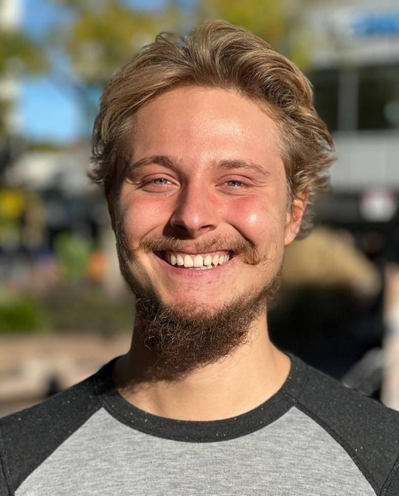

# Daten und Lebenslauf

## Adresse

Riedlistraße 26/1  
79576 Weil am Rhein  
E-Mail: calvindelloro@mail.de  
Telefon: 0177 75 75 167

## Persönliche Daten

Geburtstag: 14.10.2001  
Geburtsort: Mainz  
Staatsangehörigkeit: Deutsch  
Familienstand: ledig  
Tätigkeit: Jobsuche, nach Bachelor-Abschluss und Reise

## Berufspraxis

7/16 - 7/19 Zusteller Schülerjob Südkurier Hochschwarzwald  
PSG Baden-Württemberg, Titisee-Neustadt  
7/19 – 8/19 Archivierung Ferienjob (Excel, Auswertungsautomatismen, Scannen)
Novartis AG, Basel  
8/20 - 01/21 Game Developer Praktikum (Unity, FMOD; Programmierung, Asset-Parametrierung & Integration)  
weltenbauer. Software Entwicklung GmbH, Wiesbaden  
1/21 - 4/23 Game Developer Werkstudent (Unity; Programmierung, Asset-Parametrierung & Integration)  
weltenbauer. Software Entwicklung GmbH, Remote Furtwangen - Wiesbaden

## Ausbildung

8/06 – 7/09 Peter-Härtling-Grundschule, Mainz-Finthen  
9/09 – 7/10 Grundschule, Hinterzarten  
9/10 – 7/16 Gymnasium Birklehof, Hinterzarten  
9/16 – 6/19 Technisches Gymnasium, Titisee-Neustadt  
4/19 - 3/23 Hochschule, Furtwangen  
3/23 - -/-- Persönliche Reisen zur Aneignung kultureller Kompetenzen und Weltanschauungen

## Bildungsabschlüsse

Allgemeine Hochschulreife, Durchschnittsnote 2,3  
Bachelor of Science (Medieninformatik), Gesamtnote 1,7

## Zusätzliche Kenntnisse

**Sprachkenntnisse**

- Deutsch: Erstsprache, schriftlich & mündlich
- Englisch: Gute Kenntnisse, schriftlich & mündlich
- Tschechisch: Grundkenntnisse, schriftlich & mündlich
- Spanisch: Basiswissen, schriftlich & mündlich
- Latein: Basiswissen, schriftlich

**IT-Kenntnisse**

- Eclipse: Gute Kenntnisse
- Mathlab: Gute Kenntnisse
- Visual Studio Code: Expertenkenntnisse
- Visual Studio: Expertenkenntnisse
- Python, M, Java, Batch: Gute Kenntnisse
- C#, Javascript, Typescript: Expertenkenntnisse
- C: Grundkenntnisse

- TensorFlow/Keras, NEAT, Deep Learning
- WebXR, WebAR, Three.js, GLSL

- FMOD: Grundkenntnisse
- GODOT: Grundkenntnisse
- FUSEE: Gute Kenntnisse
- FUDGE: Expertenkenntnisse
- Unity: Expertenkenntnisse
- Blender: Expertenkenntnisse
- Excel: Gute Kenntnisse
- Gimp: Gute Kenntnisse
- FLStudio: Gute Kenntnisse

- SCRUM, Atlassian-Confluence, Mantis
- Git, Plastic SCM

## Hobbys

- Programmieren, 3D-Modeling
- Schlagzeug
  - Früher: Jugendkapelle & Trachtenkapelle Hinterzarten
  - Heute: Jazz Quintett
- Klavier, Musikproduktion
- Chemie, Physik, Mathematik, Philosophie
- Schwimmen, Turmspringen, Turnen, Aikido, Meditation
