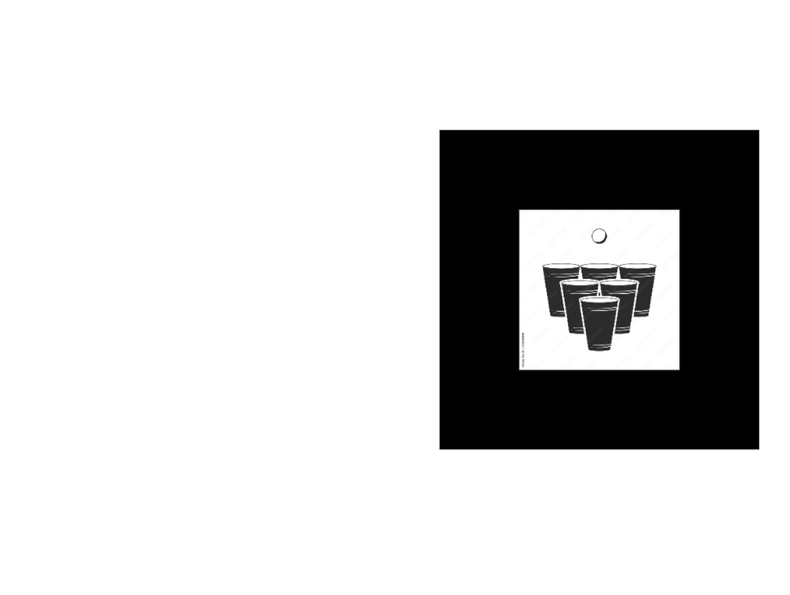
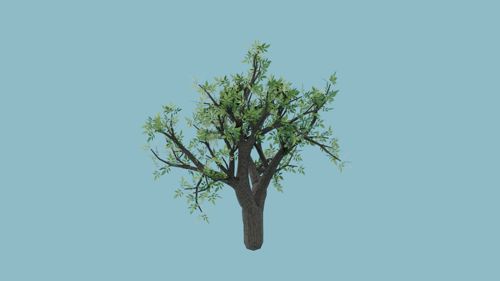

<!--  -->

<nav class ="navbar">
  <ul class = "menu">
    <li><a href="#motivation">Motivation</a></li>
    <li><a href="#header-coding">Coding</a></li>
    <li><a href="#modelling">Modelling</a></li>
    <li><a href="#video">Video</a></li>
    <li><a href="#musik">Musik</a></li>
    <li><a href="#grafik">Grafik</a></li>
    <li><a href="#dokumente">Dokumente</a></li>
  </ul>
</nav>

<blockquote>
  [Calvin Dell'Oro] arbeitete sehr <strong>effizient</strong>, <strong>routiniert</strong> und <strong>zuverlässig</strong>. 
  
  <footer>
    <cite class="author">— <a href="PraktikumsbestätigungCalvinDellOro.pdf" target = "_blank">René Nold, Geschäftsführer</a></cite>
  </footer>
  </blockquote>

<blockquote>
  <strong>weit über</strong> die vorgegebenen <strong>Lehrziele hinaus</strong> 
  
  <footer>
    <cite class="author">— <a href="EmpfehlungsschreibenVonProfChristophMueller.pdf" target="_blank">Prof. Christoph Müller</a></cite>
  </footer>
  </blockquote>

<h1 id="motivation">Motivation</h1>

  

    

      
Alter: <strong>3–9</strong> 
      <ul>
        <li>
          Erste <strong>PC-Games</strong> gespielt
        </li>
        <li>
          Level- &amp; Game-<strong>Design</strong> auf <strong>Papier</strong>
        </li>
        <li>
          Minecraft-<strong>Modifikationen</strong> &ndash; <strong>Redstone</strong>-<strong>Schaltungen</strong>
        </li>
      </ul>
      

      Seit mein Vater – ein Professori für <strong>Computerspiele</strong> – mich bereits mit <strong>drei Jahren</strong> vorsichtig an dieses Medium herangeführt hat, interessierte ich mich nicht nur für das <strong>Spielen</strong>, sondern ebenso für die <strong>Entwicklung</strong> von Games. Ich zeichnete zusätzliche Level für Super Mario oder entwarf neue Spiele &mdash; meine <strong>ersten Schritte</strong> im <strong>Game-Design</strong>. Später verbrachte ich viel Zeit damit, die Redstone-Elemente in Minecraft zu kombinieren, um <strong>logische Schaltungen</strong>, <strong>Rechensysteme</strong>, <strong>Binärzähler</strong> und <strong>Segmentanzeigen</strong> zu konstruieren. Auch die <strong>Modifikation</strong> des Spiels durch <strong>eigene Resourcepacks</strong> bereitete mir große Freude.
    

    
  

  
  

      

          
Alter: <strong>9–13</strong> 
          <ul>
            <li><strong>3D-Modellierung</strong>, Zeichnen &amp; Stop-Motion-<strong>Trickfilme</strong></li>
            <li><strong>Text-Games</strong> mit Batch</li>
            <li><strong>Grafikbearbeitung</strong></li>
          </ul>
          

          Im Alter von <strong>9 Jahren</strong> begann mein Interesse am <strong>3D-Modelling</strong>, was sich durch Architektur-Projekte in Google SketchUp und diverses Modeling in Sculpt3D widerspiegelte. Mit <strong>10 Jahren</strong> folgten kleinere <strong>Text-Games</strong>, die ich mit Batch – meiner ersten Programmiersprache – und dem Windows Editor umsetzte. Mit einem Leuchtturm von Fischer-Technik machte ich zu dieser Zeit erste Erfahrungen mit <strong>Ablaufsteuerungen</strong>. Am Nintendo DS erstellte ich <strong>Zeichentrickanimationen</strong> über das Touchpad und kleine <strong>Stop-Motion-Trickfilme</strong>. Mit <strong>11 Jahren</strong> begann ich mit der <strong>grafischen Bildbearbeitung</strong> mit Paint, mit <strong>13 Jahren</strong> intensivierte ich dieses Hobby mit <strong>GIMP</strong>.
      

      
  

  

      

          
Alter: <strong>13–14</strong> 
          <ul>
            <li>
              <strong>Pong</strong> mit Processing
            </li>
            <li>
              <strong>Dynamische 2D-Generierung</strong> mit TypeScript 
            </li>
          </ul>
          

          Etwa zur selben Zeit befreite mich <strong>TypeScript</strong> aus der Unflexibilität von Batch, was mir die <strong>dynamische Generierung zweidimensionaler Bilder</strong> auf einem Canvas ermöglichte. Im Rahmen des mehrmals besuchten Kinder-Uni-Feriencamps in Furtwangen machte ich erste Erfahrungen mit <strong>Processing</strong> und programmierte <strong>Pong</strong>. Jedes Erlernen eines neuen programmiertechnischen Werkzeugs verstärkte die Erkenntnis der Möglichkeit, meine Ideen in einem digitalen Medium festzuhalten und sie – interaktiv oder passiv – später wieder abrufbar zu machen, was meine <strong>Motivation</strong> immer weiter steigen ließ.
      

      
  

  

      

          
Alter: <strong>14–16</strong> 
          <ul>
            <li>
              Begeisterung für <strong>Vektorrechnung</strong> und <strong>fraktale Geometrie</strong>
            </li>
            <li>
              <strong>Gründung</strong> der <strong>Informatik-AG</strong> am Gymnasium
            </li>
            <li>
              Programmierung <strong>künstlicher Intelligenz</strong> zur <strong>Bildverarbeitung</strong>
            </li>
            <li>
              Programmierung <strong>Übersetzer</strong> für Geheimsprache
            </li>
          </ul>
          

          Ich erkannte durch die Programmierung die <strong>Relevanz der Mathematik</strong> in verschiedenen Bereichen und begann mit experimenteller Programmierung für verschiedene Fächer am <strong>technischen Gymnasium</strong>, wo auch meine erste formale Ausbildung in Informatik begann. Mit <strong>15 Jahren</strong> entwickelte ich eine regelrechte Begeisterung für die Möglichkeiten der <strong>Vektorrechnung</strong> und <strong>fraktalen Geometrie</strong>. Zusammen mit einem Lehreri und einem Mitschüleri, mit dem ich einen <strong>Übersetzer</strong> für eine ausgedachte <strong>Geheimsprache</strong> programmierte, gründete ich eine <strong>Informatik-AG</strong>. In dieser wagten wir uns an die Programmierung <strong>neuronaler Netzwerke</strong>, um mit <strong>künstlicher Intelligenz</strong> zu experimentieren, besonders in der <strong>Echtzeit-Bildverarbeitung</strong> eines Live-Kamerabildes.
      

      
  

  

      

          
Alter: <strong>17–18</strong> 
          <ul>
            <li>
              <strong>Erstsemester</strong>-Selbststudium – <strong>Game of Life &amp; Tic-Tac-Toe</strong>
            </li>
            <li>
              <strong>GGJ VR-Spiel</strong> – Gamedesign und Sound (Fuwashima)
            </li>
            <li>
              Private Fortbildung – <strong>Unity</strong> und <strong>Blender</strong>
            </li>
          </ul>
          

          Im Rahmen der freiwilligen Aufgaben des Programmiermoduls des ersten Semesters meines abgeschlossenen Studiums entwickelte ich mit Java einen ewigen Kalender, <strong>Game of Life</strong> und <strong>Tic-Tac-Toe</strong>. Letzteres baute ich mit einem zufällig spielenden Computergegneri aus, der zum Trainieren einer künstlichen Intelligenz genutzt werden soll. 
          Beim <strong>Global Game Jam 2020</strong> im Spiellabor der Hochschule wirkte ich in einem Team bei der Entwicklung eines <a href="#fuwashima">VR-Spiels</a> mit. Meine Hauptaufgaben lagen im <strong>Gamedesign</strong> und <a href="#fuwashima"><strong>Sound</strong></a>. Dieses Event weckte bei mir erneut das Interesse an der <strong>3D-Programmierung</strong> und dem <strong>3D-Modeling</strong>, weshalb ich mich intensiver mit <strong>Unity</strong> und <strong>Blender</strong> beschäftigte.
      

      
  

  

      

          
Alter: <strong>18–20</strong> 
          <ul>
            <li>
              Angestellt als <strong>Tutori</strong> für Programmierung
            </li>
            <li>
              <strong>360°</strong>-Point-and-Click &amp; Eisladen-<strong>Browsergame</strong>
            </li>
            <li>
              <strong>Praktikum</strong> &amp; <strong>Werkstudium</strong> – <strong>Bau-Simulator</strong> bei <strong>weltenbauer.</strong>
            </li>
            <li>
              <strong>Horrorgame Morbus Animi</strong>, <strong>Fantasy-Roguelike</strong>, <strong>AR-Bierpong-Browsergame</strong>
            </li>
          </ul>
          

          Ab Oktober 2019 studierte ich sieben Semester lang <strong>Medieninformatik</strong> an der Hochschule Furtwangen. Nach dem ersten Semester erhielt ich von meinen Professoren für Mathematik und Informatik Anfragen, als <strong>Tutor</strong> für Programmierung tätig zu werden. 
          Ich beendete das zweite Semester mit einer <a href="dischoverhfu"><strong>360°-Panorama-Verkörperung</strong></a> der Schnitzeljagd an der Hochschule Furtwangen sowie einer <a href="#eisladen"><strong>Eisladen-Website</strong></a> mit Server, realisiert als Browsergame.
          Mein Praktikum im dritten Semester absolvierte ich bei <a href="https://www.weltenbauer-se.com/de" target = "_blank"><strong>weltenbauer. Software Entwicklung GmbH</strong></a>, wo ich im Development-Team am <strong>Bau-Simulator</strong> mitarbeitete. Das Unternehmen behielt mich anschließend zwei weitere Jahre als Werkstudenti. 
          Im vierten und fünften Semester, dem <strong>Projektstudium</strong>, entwickelte ich mit einem sechsköpfigen Team das psychologische <a href="morbus-animi"><strong>Horrorspiel Morbus Animi</strong></a>. Im sechsten Semester folgten weitere Spiele wie <a href="the-last-hope"><strong>The Last Hope</strong></a>, ein <strong>Roguelike</strong>, oder <a href="realtime-beerphong"><strong>BeerPhong</strong></a>, eine browserbasierte <strong>AR</strong>-Version des bekannten Partyspiels.
      

      
  

 

 

<a href="Lebenslauf.pdf" target="_blank"><i class="fa-solid fa-file-lines"></i>&nbsp;&nbsp;Ausführlicher Lebenslauf</a>

    

        <i class="fa-solid fa-graduation-cap"></i>
        
Mit <strong>21 Jahren</strong> schloss ich das <strong>Studium</strong> mit meiner <a href="#neuroevolution-benutzerdefinierter-mehrbeiniger-kreaturen"><strong>Bachelor-Thesis</strong> "Neuroevolution benutzerdefinierter mehrbeiniger Kreaturen"</a> ab. In einem Editor werden <strong>Knochen–Gelenk–Konstruktionen</strong> erstellt, die durch <strong>Mutationen</strong> über Generationen hinweg <strong>Laufmuster</strong> von Grund auf lernen.

    

    

        <i class="fa-solid fa-flag-checkered"></i>
        
Gerne programmiere ich <strong>Spiele ohne Gewaltdarstellungen</strong> und biete Spieleris eine eher <strong>friedliche</strong> und <strong>meditative Erfahrung</strong>. Bei Mehrspielermodi sollten alle <strong>konstruktiv</strong> und <strong>kooperativ</strong> zusammenarbeiten.   
        Optimalerweise verzichtet das Spiel auf Gegneris und vermittelt <strong>intuitive Einsichten</strong> über tiefgreifende Themen und <strong>Philosophien</strong>. <strong>Puzzle-Games</strong>, <strong>Aufbau-Strategiespiele</strong> sowie <strong>Cozy–</strong> oder <strong>Educational-Games</strong>, <strong>Simulatoren</strong> oder <strong>Musik–, Sound– und Rhythm-Games</strong> kommen besonders infrage.

    

    

        <i class="fa-solid fa-screwdriver-wrench"></i>
        
<strong>Programmieren</strong> stellt meine <strong>Haupttätigkeit</strong> dar. Grundlegende <strong>3D-Modelling–</strong> und <strong>Design-Kenntnisse</strong> sind vorhanden, jedoch nicht als Haupttätigkeit bevorzugt. Daneben bin ich <strong>musikalisch begabt</strong> und spiele viele Instrumente – digital wie akustisch. Daher wirke ich gerne in der <strong>Soundgestaltung</strong> und <strong>Soundtechnik</strong> des Spiels mit.

    

    

        <i class="fa-solid fa-circle-check"></i>
        
Auf dieser Seite sammle ich einige meiner <strong>Arbeiten</strong>, um einen <strong>Beleg</strong> für meinen <strong>Enthusiasmus</strong> und meine <strong>Lernfähigkeit</strong> zu liefern und Interesse für ein Angebot als <strong>Spieleprogrammiereri</strong> zu wecken.

    

<!-- pdf icon -->
<link href="https://cdnjs.cloudflare.com/ajax/libs/font-awesome/5.15.4/css/all.min.css" rel="stylesheet">
<!-- person icon -->
<link href="https://fonts.googleapis.com/icon?family=Material+Icons" rel="stylesheet">
<!-- calendar icon -->
<link rel="stylesheet" href="https://cdnjs.cloudflare.com/ajax/libs/font-awesome/4.7.0/css/font-awesome.min.css">
<!-- clock icon -->
<link href="https://cdnjs.cloudflare.com/ajax/libs/font-awesome/5.15.4/css/all.min.css" rel="stylesheet">
<!-- user tie -->
<!-- persons icon -->
<link rel="stylesheet" href="https://cdnjs.cloudflare.com/ajax/libs/font-awesome/6.5.1/css/all.min.css">
<!-- umbrella icon -->
<link rel="stylesheet" href="https://cdnjs.cloudflare.com/ajax/libs/font-awesome/6.7.2/css/all.min.css">

<blockquote>
  Durch […] <strong>schnelle Auffassungsgabe</strong>, […] <strong>aktive Beteiligung</strong> und  
  […] nie erlahmende Bereitschaft zum <strong>Mit- bzw. Weiterdenken</strong> 
  [ist Calvin Dell’Oro] von Beginn an positiv aufgefallen. 
  
  <footer>
    <cite class="author">— <a href="EmpfehlungsschreibenVonProfDrThomasSchneider.pdf" target = "_blank">Prof. Dr. rer. nat. Thomas Schneider</a></cite></footer>
  </blockquote>

<blockquote>
  Dell'Oro genießt in unserem Hause <strong>hohes Vertrauen</strong> und war stets <strong>ehrlich</strong>, <strong>pünktlich</strong> und <strong>fleißig</strong>. 
  
  <footer>
    <cite class="author">— <a href="PraktikumsbestätigungCalvinDellOro.pdf" target="_blank">René Nold, Geschäftsführer</a></cite>
  </footer>
  </blockquote>

<i class="fa-solid fa-code"></i>
<h1 id="header-coding">Coding</h1>

  

    

      <h2 id ="bau-simulator">Construction Simulator®</h2>
    

    

      <a href="https://store.steampowered.com/app/1273400/BauSimulator" target = "_blank">
      <video width="100%" poster = "ConstructionSimulatorThumbnail.jpg" controls loop>
          <source src="ConstructionSimulator.mp4" alt="ConstructionSimulator" type="video/mp4"/>
          Ihr Browser unterstützt den Video-Tag nicht
      </video>
      </a>
      

      
Klicken zum Spielen

      
<i class="fas fa-times"></i>

    

    

      

        <i class='fas fa-users'></i>&nbsp;&nbsp;25+
      

      

        <i class="fa-solid fa-user-tie"></i>
      

      

        Unity
        C#
        FMOD
      

      <i class="fa fa-calendar"></i>&nbsp;&nbsp;2y 6m
    

    

      <h4>
      <a href="https://www.weltenbauer-se.com/de" target = "_blank">weltenbauer. Software Entwicklung GmbH</a> 
      25‑köpfiges Team + Outsourceris 
      Herbst 2020 – Frühling 2023 
      Publisher: <a href = "https://www.astragon.de/" target = "_blank">Astragon</a>
      </h4>
    

    

       
      <strong>6</strong> Monate <strong>Praktikum</strong> 
      <strong>2,5</strong> Jahre <strong>Werkstudium</strong> 
       
      

      <strong>Unity (C#), FMOD (Audio-Integration)</strong> 
      <em>Strukturiert – Interdisziplinär – Kooperativ</em> 
      <strong>SCRUM, Atlassian Confluence, Plastic SCM, Mantis</strong> 
      

       
      <ul class="task-list">
      <li><strong>Fahrzeug-Setup</strong> 
          Integration von dutzenden Fahrzeugmodellen mit funktionsspezifischen Logikbausteinen
          <ul>
              <li>Rotationslimits, Getriebe- und Motorsimulation, Terrainsimulation</li>
              <li>Fahrzeugaudio mit FMOD</li>
          </ul>
      </li>
      <li><strong>Debug-UI-Entwicklung</strong> 
          Erstellung eines dynamischen und generischen Debug-Tools für
          <ul>
              <li>Missionen, Fahrzeug-Spawning, Settings</li>
          </ul>
      </li>
      <li><strong>Navigationsdisplay</strong> 
          Anzeige des Pfades in der Minimap.
      </li>
      </ul>
    

    <!-- Im Dev-Team bei <a href="https://www.weltenbauer-se.com/de">weltenbauer. Software Entwicklung GmbH</a> arbeitete ich mit insgesamt 25 Mitarbeitern und weiteren Outsourcern vom Winter 2020 bis zum Frühling 2023. Begonnen als Praktikant im Büro für das dritte Semester, behielt mich das Unternehmen überzeugt als Werkstudent bis zum Bachelor-Abschluss. So sammelte ich zwei weitere Jahre lang Erfahrung in der Programmierung eines kommerziellen Mid-Tier Games. Neben strukturellem Arbeiten mit agilem Projektmanagement, wie SCRUM-Sprintmeetings, Atlassian Confluence, Versionskontrolle, Bugtracking mit Mantis in einem größeren Team und Orientierung nach Vorgaben eines kommerziellen Publishers (<a href = "https://www.astragon.de/">Astragon</a>), sowie Synergie mit Grafiker- und QA-Departments vertiefte ich mich in fortgeschrittene Programmierung mit Unity und C#. Desweiteren lernte ich FMOD als Audio-Integrationssoftware für Unity kennen.  
    Meine Hauptbeschäftigung bestand aus dem Fahrzeug-Setup, bei dem ich Modelle der Grafiker mit Logikbausteinen der Programmierer zu funktionsfähigen Baumaschinen integrierte. Da jedes der >80 Fahrzeuge sich in seinen Funktionen unterscheidet, wie beispielsweise Rotationslimits von Schaufeln und Armen oder Schaltpunkte der Motoren- und Getriebesimulation, zeichnete sich das Fahrzeug-Setup größtenteils durch Parametrierung der Logik-Assets aus. Ein weiterer Bestandteil war die intensive Kommunikation mit dem Grafik-Team, falls Meshes der Modelle ausgetauscht oder ergänzt werden mussten. Besonders im Bereich des Hydraulik-, Fahrkabinen-, Licht-, und Spiegel-Setups war die interdisziplinäre Kooperation mit dem Art-Department essentiell. Viele Ressourcen flossen auch in das Aufsetzen der Terrainsimulation, um Schuttfüllungen in verschiedenen Werkzeugen wie Schaufeln und Kipper von Mulden zu realisieren. Auch zum Fahrzeug-Setup gehörte die auditive Simulation des Baugeschehens, bei dem ich den Umgang mit Banks in FMOD lernte.  
    Meine restliche Arbeit am Bau-Simulator bestand zum Einen aus der Programmierung eines zentralen Debug-UserInterfaces, mit dem neben allen Departments vor allem die Tester der Quality-Assurance das Command-System grafisch aufbereitet und effizient benutzen können. Darunter fällt das Springen zu und Erledigen von Missionen, Spawnen von Fahrzeugen, Cargo und Props, Einstellen globaler Parameter und weitere Steuerung des Spielgeschehens auf vielen Ebenen. Für die Realisierung des Aufbaus und Designs wählte ich einen dynamisch-generischen Ansatz, der das gesamte Command-System des Spiels als Konstellation von Knöpfen, Reglern und Eingabefeldern, geordnet unter mehreren Hierarchieebenen, generiert. Somit verringerte sich der Wartungsbedarf, da neu registrierte Kommandos direkt richtig in dem Debug-UI dargestellt werden.  
    Zum Anderen bestand meine Arbeit auch aus der Programmierung einer Anzeige des Navigations-Pfades in der Minimap, um Spieler anschaulich zu ihrem Ziel in der Welt zu leiten. Hier halfen mir meine Kenntnisse der Projektion von Räumen höherer Dimensionen in Räume niederer, die ich bereits in dem Kurs "Mathematik und Simulation" erlernte -- Link zum entsprechenden Projekt --   -->
  

  

    <h2 id="neuroevolution-benutzerdefinierter-mehrbeiniger-kreaturen">Neuroevolution</h2>
    

        <a href="https://simmer.io/@DerCalvino/neuroevolutionbenutzerdefiniertermehrbeinigerkreaturen" target = "_blank">
            <video width="100%" poster ="NeuroevolutionThumbnail.jpg" controls loop>
                <source src="BachelorThesis.mp4" alt="BachelorThesis" type="video/mp4"/>
                Ihr Browser unterstützt den Video-Tag nicht
            </video>
        </a>
        
Klicken zum Spielen

        

          

            <i class="material-icons">person</i>1
          

          

            <i class="fa fa-graduation-cap"></i>
            <i class="fa fa-university"></i>
          

          

            NEAT
            AI
          

          <i class="fa fa-calendar"></i>&nbsp;&nbsp;6m
        

    

    <h4>
      <a href="NeuroevolutionBenutzerdefinierterMehrbeinigerKreaturen.pdf"  target = "_blank">
        <i class="fas fa-file-pdf"></i> Bachelor Thesis
      </a> 
      Solo-Projekt 
      Herbst 2022 – Frühling 2023 
      AI-Playground
    </h4>
     
    

        <strong>Unity (C#), <a href = "https://en.wikipedia.org/wiki/Neuroevolution_of_augmenting_topologies"  target = "_blank">NEAT</a></strong> 
        <em>Forschungsorientiert – Innovativ – Selbstständig</em> 
        <strong>Git, Roadmap, Kanban-Board</strong> 
    

     
    <ul class="task-list">
    <li><strong>Evolutionäre Algorithmen</strong> 
        Selektion, Rekombination und Mutation
        <ul>
            <li>Lernen von Kreaturenbewegungen über Generationen hinweg</li>
        </ul>
    </li>
    <li><strong>Simulations-basierte KI-Entwicklung</strong> 
        Kreation und Training eines neuronalen Netzwerks
        <ul>
            <li>Instanzen laufen in physikalischer Simulation</li>
        </ul>
    </li>
    <li><strong>Editor für Kreaturenbau</strong> 
        Erstellen und Modifizieren von Kreaturen
        <ul>
            <li>Hinzufügen und Einstellen von Gliedern und Gelenken</li>
        </ul>
    </li>
    </ul>
    

    Kamera: Mausbewegung und Drücken, Scrollen 
    Bauen neuer Glieder: Starten mit Linksklick, Verlängerung mit Mausbewegung 
    Bauen Abschließen: erneuter Linksklick 
    Bauen Abbrechen: rechte Maustaste 
    Rotations-Einstellungs-Modus: "R" 
    Weitere Anleitung: <a href ="NeuroevolutionBenutzerdefinierterMehrbeinigerKreaturen.pdf"  target = "_blank">Thesis</a>
    

    <!-- Dieser AI-Playground ist die Methode meiner Bachelor-Thesis des siebten Semesters. Es ermöglicht Benutzern, eine Kreatur aus Gliedern und Gelenken nach Belieben in einem Editor zu bauen, sowie Rotationslimits der Glieder anzupassen. Im zweiten Schritt startet eine Simulation, bei dem der Kreatur ein vollständig verbundenes künstliches Neuronales Netzwerk zugeteilt wird. Daten über aktuelle Pose und Position werden als Sensoren oder Inputs in das Netz eingespeist, Outputs sind die angestrebten Winkel der Gelenke. Über Generationen hinweg werden die Kreatur und ihre Mutationen je nach räumlichem Fortschritt belohnt, selektiert und die besten Gene in die nächste Generation weitergetragen, wo sie wieder mutieren. Somit lernen die Bauten zu laufen.  
    Zugrunde liegen Evolutionäre Algorithmen, die Probleme ähnlich biologischer Organismen lösen, da genetische Operatoren wie Selektion, Rekombination und Mutation die Evolution durch Reproduktion der stärksten Gene steuern. In meiner Bachelor-Arbeit nutzte ich die topologische Flexibilität von NEAT (Neuroevolution of Augumenting Topologies) um die Kreaturen durch evolvierende Genome zu bewegen. Untersucht habe ich, welche Berechnungsmethode und Parameter-Konfiguration des NEAT-Algorithmus' zu der weitesten Laufdistanz verschiedener Kreaturen führt, ohne Laufmuster vorzugeben. Ich wollte eine Anwendung entwickeln, die ohne weitere Eingriffe des Nutzers zu Laufmustern seiner erstellten Kreaturen führt. Durch diese Arbeit entwickelte ich die Fähigkeit, künstliche Intelligenzen auf Basis von evolutionär veränderten Neuronalen Netzen zu programmieren und trainieren, sowie einen InGame-Editor in Unity zu programmieren.  
    Die Kamera kann im Editor mit Mausbewegung und Drücken sowie Scrollen der mittleren Maustaste gesteuert werden. Bauen neuer Glieder wird mit Linksklick gestartet und mit Mausbewegung verlängert. Ein erneuter Linksklick schließt das Bauen ab, während die rechte Maustaste das Bauen abbricht. Den Rotations-Einstellungs-Modus schalten Sie mit "R" um. Weitere Anleitung finden Sie in der <a href = "NeuroevolutionBenutzerdefinierterMehrbeinigerKreaturen.pdf">Thesis</a> -->
  

  

    <h2 id="morbus-animi">Morbus Animi</h2>
    

        <a href="https://simmer.io/@DerCalvino/morbus-animi-final"  target = "_blank">
            <video width="100%" poster = "MorbusAnimiThumbnail.jpg" controls loop>
                <source src="Morbus-Animi.mp4" alt="Morbus-Animi" type="video/mp4"/>
                Ihr Browser unterstützt den Video-Tag nicht
            </video>
        </a>
        
Klicken zum Spielen

        

          

          <i class='fas fa-users'></i>&nbsp;&nbsp;6
          

          

            <i class="fa fa-university"></i>
            <i class="fas fa-award"></i>
          

          

            Horrorgame
            JumpNRun
            NavMesh
          

          <i class="fa fa-calendar"></i>&nbsp;&nbsp;1y
        

    
  
    <h4>
        Projektstudium 
        6-köpfiges Team 
        Frühling 2021 – Frühling 2022 
        Horrorspiel, IndieNight-Erstplatziert
    </h4>
     
    

        <strong>Unity (C#), NavMesh</strong> 
        <em>Teamorientiert – Strukturiert – Erzählstark</em> 
        <strong>Style Guides, Dokumentation, Roadmap, Kanban, SCRUM, Git</strong>
    

     
    <ul class="task-list">
      <li><strong>Fortgeschrittener Camera-Controller</strong> 
          Programmierung eines intelligenten Third-Person-Kamerasystems
          <ul>
              <li>Verdeckung, Bewegung, Hindernis-Vermeidung</li>
          </ul>
      </li>
      <li><strong>Modulare Asset-Programmierung</strong> 
          Erstellung parametrischer Assets zur flexiblen Anpassung durch andere Abteilungen
          <ul>
              <li>Dynamische Elemente: Story, Level, Puzzle, Effekt, Sound</li>
          </ul>
      </li>
      <li><strong>Spielmechanik & Physik</strong> 
          Entwicklung eines Jump-and-Run
          <ul>
              <li>Schwingen, Greifen, Hangeln, Parkour</li>
          </ul>
      </li>
      <li><strong>KI-Gegneri & Steuerung</strong> 
          Programmierung und Balancing der Gegneri-KI (Unity NavMesh)
          <ul>
              <li>Anpassungsfähige Verfolgungs- und Fluchtmechaniken</li>
          </ul>
      </li>
      <li><strong>Details & Technische Tiefe</strong> 
          Diverses Coding zur Steigerung der Immersion und Interaktivität
          <ul>
              <li>Bone-Rigs mit Multi-Aim Constraints & Weights</li>
          </ul>
      </li>
    </ul>
    

        Steuerung wird im Spiel erklärt.
    

    <!-- Mit zwei Grafikerinnen, einem VFX-Spezialist, einem Storyteller, einem anderen Programmierer und mir entwickelten wir im vierten und fünften Semester im Rahmen des Projektstudiums dieses psychische Horrorspiel. Auch bei der Organisation dieses Projekts half die Erfahrung mit dem SCRUM-System im kommerziellen Umfeld bei <a href="https://www.weltenbauer-se.com/de">weltenbauer. Software Entwicklung GmbH</a>. 
    Ich übernahm bis auf Inventar, Collectables und Menü-GUI das Coding der Skripte, um Spielmechanik, Physik-, Animations-, Sound- und KI-Controller, sowie UserInterfaces und Spielbalance zu realisieren. Besonders die Programmierung des Jump-and-Runs, mit Schwingen und Greifen sowie Hängen an Kanten, lag in meinem Fokus und lieferte eingängige Lernerfahrungen. Gleiches gilt für Entwicklung und Balancing des KI-Gegners mit Unity NavMesh. Auch mit dem Coding modularer Assets bereicherte ich das Projekt und die Kooperation, da andere Abteilungen diese parametrisierten, um Spielgeschehen wie Story-Fortschritt, Puzzle-Logik, Effekte und Sounds zu steuern. Mit diesem Titel gewannen wir den ersten Platz der Projektausstellung bei der "IndieNight" an der Hochschule Furtwangen.  
    Die Steuerung wird im Spiel erklärt. -->
  

  

      <h2 id="the-last-hope">The Last Hope</h2>
      

          <a href="https://simmer.io/@DerCalvino/thelasthope"  target = "_blank">
              <video width="100%" poster = "TheLastHopeThumbnail.png" controls loop>
                  <source src="TheLastHope.mp4" alt="TheLastHope" type="video/mp4"/>
                  Ihr Browser unterstützt den Video-Tag nicht
              </video>
          </a>
          
Klicken zum Spielen

          

            

              <i class='fas fa-users'></i>&nbsp;&nbsp;6
            

            

              <i class="fa fa-university"></i>
              <i class="fas fa-award"></i>
            

            

              Rouge-like
              NavMesh
            

            <i class="fa fa-calendar"></i>&nbsp;&nbsp;6m
          

      
  
      <h4>
          Gamedesign-Workhop 
          6-köpfiges Team 
          Sommer – Herbst 2022 
          Rouge-like, IndieNight-Auszeichnung
      </h4>
       
      

          <strong>Unity (C#), NavMesh</strong> 
          <em>Kreativ – Kooperativ – Interdisziplinär</em> 
          <strong>Gameplay-Design, Wireframes, User Tests, Klassendiagramme, Sounddesign, Kanban-Board, SCRUM, Git</strong> 
      

       
      <ul class="task-list">
        <li><strong>Spielmechanik & Physik</strong> 
            Programmierung der Spielphysik und Mechaniken
            <ul>
                <li>Beschwörungs- und Zauberkampfsystem, Spielbalance</li>
            </ul>
        </li>
        <li><strong>KI-Controller</strong> 
            Logik von KI-Gegneris (Unity-NavMesh)
            <ul>
                <li>Bewegungssteuerung, intelligentes Angreifen</li>
            </ul>
        </li>
        <li><strong>Sound & Animation</strong> 
            Integration von Soundeffekten und Animationen</li>
        <li><strong>User Interface</strong>  
            Design und Implementierung der Bedienoberfläche 
            <ul>
                <li>Kombination von Fähigkeitskarten</li>
            </ul>
        </li>
      </ul>
      

          W, A, S, D zum Laufen 
          Maustasten, Q, E zum Angreifen 
          Inventar: I 
          Fähigkeitskarten kombinieren: Drag and Drop
      

      <!-- "Conflux - TheLastHope" entstand in einem sechsköpfigen Team. Im Kurs "Gamedesign Workshop" des sechsten Semesters programmierte ich den Großteil des Unity-Spiels, wie Spielmechanik, Physik-, Animations-, Sound- und KI-Controller, sowie UserInterfaces und Spielbalance. Begonnen mit Themenwahl, Abstimmung über Spielideenvorstellung und einer gemeinsamen Vision und Moodboard, einigten wir uns auf ein Rouge-like, dessen Story sich an H.P.Lovecrafts "Cthulhu-Mythos" orientiert. Der Spieler als Auserwählter utilisiert die 4 Elemente von Gott und Teufel kombinatorisch, um gegen die drohende Instabilisierung des Gleichgewichts durch Cthulhu der Erde anzukämpfen. Es folgten Gameplaypillars und -Loops, USP-Definition, Wireframes für Menüs und Fähigkeitskarten, Bedienungsprofile, Klassendiagramme, Sounddesign, Kanban-Boards und Priorisierungslisten, während in SCRUM-Meetings sorgfältig protokolliert und reviewed wurde. Hierbei half die bereits vorhandene Erfahrung im professionellen Umfeld bei <a href="https://www.weltenbauer-se.com/de">weltenbauer. Software Entwicklung GmbH</a>.  
      Das Projekt endete mit UserTests inklusive Fragebögen, sowie dem Gewinnen der Projektauszeichnung bei der "IndieNight" an der Hochschule Furtwangen.  
      Laufen erfolgt mit W A S D, Angreifen mit den Maustasten, Q und E. I öffnet das Inventar. Drag and Drop von einer Fähigkeitskarte auf eine andere ermöglicht das Kombinieren. -->
    

    

      

      <h2 id="realtime-beerpong">Realtime-BeerPhong</h2>
      

      

        <a href="https://calvindo.github.io/Realtime-BeerPhong/aFrame.html"  target = "_blank">
          

            
            
Klicken zum Spielen

          

        </a>  
        <a href="BeerPhongMarker.png" download>
          

            
            
Klicken zum Marker

          

        </a>
        
<i class="fas fa-times"></i>

      

        

          

            <i class='fas fa-users'></i>&nbsp;&nbsp;3
          

          

              <i class="fa fa-university"></i>
            

          

            WebAR
            GLSL
            JS
            Three.js
          

          <i class="fa fa-calendar"></i>&nbsp;&nbsp;3m
        

      

        <h4>
        Echtzeit-Computergrafik 
        Trio-Team 
        Herbst 2022 
        Mobile Web-AR Partyspiel
        </h4>
      

      

         
        

          <strong>WebAR, JavaScript, GLSL, Three.js</strong> 
          <em>Innovativ – Kollaborativ – Kreativ</em> 
          <strong>Dokumentation, UI/UX, Sprint-Meetings, Git</strong>
        

         
        <ul class="task-list">
          <li><strong>Shader-Programmierung</strong> 
              Erstellung von Vertex- und Fragment-Shadern für AR-Rendering
              <ul>
                  <li>Beleuchtung, Materialeffekte, visuelle Optimierung</li>
              </ul>
          </li>
          <li><strong>Physik & Wurfmechanik</strong> 
              Implementierung der Ballflugbahn
              <ul>
                  <li>Aufprall- und Abprall-Logik, Touchscreen-Gestensteuerung</li>
              </ul>
          </li>
          <li><strong>Augmented Reality & Web-Integration</strong> 
              Nutzung von WebAR & Three.js
              <ul>
                  <li>Platzierung des Spieltisches über einen AR-Marker</li>
              </ul>
          </li>
        </ul>
        

            Smartphone-Kamera auf Marker richten 
            Swipen zum Werfen 
        

      

      <!-- Dieses webbasierte Mobile-Game erfordert einen AR-Marker, über dem auf dem Smartphone ein Beerpong-Tisch mit Bechern als Ziele generiert wird. Der Spieler bewegt sich um den Tisch herum, um aus einer günstigen Abwurfposition heraus den Ball mit einem Swipe auf dem Touchscreen so in die Spielszene zu werfen, dass er direkt oder nach Aufkommen auf der Platte in einem Becher landet.  
      Die Umsetzung innerhalb des Kurses "Echtzeit-Computergrafik" im sechsten Semester erfolgte mit WebAR, JavaScript und GLSL. In einem dreiköpfigen Team machten wir uns mit Programmierung von Vertex- und Fragmentshadern vertraut, sowie mit Umgebungsvariablen von WebAR und "Three.js". -->
    

    

      <h2 id="gesetzestext-generator">Gesetzestext-Generator</h2>
      

        
        
Klicken zum Anwenden

        

          

            <i class="material-icons">person</i>1
          

          

            <i class='fas fa-umbrella-beach'></i>
          

          

            Python
            TensorFlow
            RNN
            GRU
          

          <i class="fa fa-calendar"></i>&nbsp;&nbsp;10d
        

      
  
      <h4>
        Introduction to Deep Learning 
        Solo-Selbststudium 
        Frühling 2022 
        AI-Experiment
      </h4>
       
      

          <strong>Python, Keras (TensorFlow), Jupyter Notebook, Language Model, Recurrent Neural Networks (RNN), GRU</strong> 
          <em>Forschungsorientiert – Innovativ – Selbstständig</em> 
          <strong>Google Colab, Git</strong> 
      

       
      <ul class="task-list">
        <li><strong>Trainingsdatensatz & Vorverarbeitung</strong> 
            Erstellung eines Textmodells mit Bürgergesetzbuch als Trainingsdaten
            <ul>
                <li>Umwandlung des Textes in sequenzielle Eingaben und Zielzeichen</li>
            </ul>
        </li>
        <li><strong>Neuronale Netzwerk-Architektur</strong> 
            Implementierung eines GRU-basierten RNNs in Keras
            <ul>
                <li>Architektur aus Embedding, GRU und Dense-Schichten</li>
            </ul>
        </li>
        <li><strong>Textgenerierung</strong> 
            Erzeugung von neuen Paragraphen basierend auf beliebigen Startzeichen
            <ul>
                <li>Anpassung der Vorhersage durch Temperatur</li>
            </ul>
        </li>
        <li><strong>Zukünftige Erweiterungen</strong> 
            Testen von LSTM und GPT für verbesserte Textgenerierung
            <ul>
                <li>Vergleich der Performance und Effizienz</li>
            </ul>
        </li>
      </ul>
      

          Code-Blöcke in Colab ausführen, Kommentare beachten
      

      <!-- Das Bürgergesetzbuch als Trainingsdaten eingespeist, "erfindet" mein Gesetzestext-Generator neue Paragraphen am laufenden Band. Dieses Freizeitprojekt ist eine --darüber hinausgehung-- des Kurses "Introduction to Deep Learning" im fünften Semester, in dem ich bereits Logistische Regression mit BCE und Softmax, Backpropagation und Convolutional Neural Networks erlernte.  
      Das gesamte Projekt wurde in einem Jupyter Notebook mit Python entwickelt. Zuerst werden die Trainingsdaten für das Language Model, hier das Gesetzbuch als String mit 1,8 Millionen Zeichen, geladen, und einzigartige Zeichen im Text analysiert. Diesen werden IDs zugeordnet und der Text in eine Sequenz von solchen umgewandelt. In Input- und Target-Sequenzen aufgeteilt, stellt das Target das nächste Zeichen der Sequenz dar.
      Für die Architektur wählte ich das Keras Model von Tensorflow mit einem GRU (Gated Recurrent Unit) Layer als Hauptkomponente. Vorrangeschaltet ist ein Embedding-Layer, in dem eine beliebig lange Input-Sequenz zu einem dichten Vektor umgewandelt wird, während eine vollständig verbundene Dense-Schicht den finalen Output berechnet - der Wahrscheinlichkeit für das nächste Zeichen.  
      Nach der Erstellung des Modells wird es mit dem vorbereiteten Datenset trainiert. Ich habe die SparseCategoricalCrossentropy-Loss-Funktion verwendet, um den Fehler zwischen den Vorhersagen und den Zielzeichen zu messen. An diesem Loss lernt das Modell, und versucht, ihn zu minimieren. Auch habe ich einen Checkpoint-Mechanismus zur Persistenz eingerichtet.  
      Das Modell generiert nun auf Basis eines gegebenen Startzeichens mit einem One Step Model Zeichen für Zeichen neuen Text. Bei jedem Schritt trifft das Modell eine Vorhersage für das nächste Zeichen, wobei die Wahrscheinlichkeiten für mögliche Zeichen mittels der Temperatur angepasst werden können. Dies beeinflusst, wie zufällig oder deterministisch die generierten Zeichen sind.  
      Geplant ist Implementierung von und Testen der Performance von LSTM als weitere RNN-Struktur am Bürgergesetzbuch, sowie GPT als generativer Transformer wegen Self-Attention- und Parallelisierungsmechanismen. Auch würde die Verwendung einer Wörterbuch-Datenbank würde Effizienz in dem Use Case des Gesetzesbuchs deutlich steigern, allerdings zu weniger komischen Neologismen führen. -->
    

    

    <h2 id="baumgenerator">Baumgenerator</h2>
    

      
      
Klicken zum Downloaden

      

        

          <i class='fas fa-users'></i>&nbsp;&nbsp;3
        

        

          <i class="fa fa-university"></i>
        

        

          Blender API
          Vektorrechnung
        
 
        <i class="fa fa-calendar"></i>&nbsp;&nbsp;3m
      

    

    <h4>
      Datenverarbeitung in der Medienproduktion 
      Trio-Team 
      Frühling 2022 
      Blender-Addon
    </h4>
     
    

      <strong>Python, Blender API, Vektorrechnung</strong> 
      <em>Kollaborativ – Systematisch – Flexibel</em> 
      <strong>Roadmap, Kanban, Git</strong>
    

     
    <ul class="task-list">
        <li><strong>Parametrisierte Baumgenerierung</strong> 
          Entwicklung eines Addons zur Generierung prozeduraler Bäume
          <ul>
            <li>Einstellbare Ast-Abspaltungen, Ausrichtung, Radius, Zufallsfaktoren</li>
          </ul> 
        </li>
        <li><strong>Rekursion & Vektorrechnung</strong> 
          Vertiefung und Erweiterung des technischen Vokabulars
          <ul>
            <li>Rekursive Python-Programmierung</li>
            <li>Rodrigues-Rotationsformel, Kreuzprodukt, ...</li>
          </ul>
        </li>
        <li><strong>Blender-Addon-Integration</strong> 
          Realisierung als Addon in Blender mit User-Interface
          <ul>
            <li>Nutzung der Blender-API</li>
          </ul>
        </li>
    </ul>
    

      "Addon.py" importieren, "Generate Tree"-Button im Scene-Tab des Property-Windows klicken
    

    <!-- Diesen parametrisierten Baumgenerator als Blender-Addon entwickelte ich in einem Team, bestehend aus einem weiteren Programmierer und Grafiker, der die Blätter und die Rinde der Bäume entwarf. Benutzer können in dem Tooltip die Anzahl der Ast-Abspaltungen, die Ausrichtungsstärke gen Himmel und den Radi us einstellen. Auch rekursive Parameter eines jeden Astes zu seinem auswachsenden Ast sind einstellbar, Verkürzung der Länge und des Radius', Änderung der Verkürzung der Winkel und Zufallsabweichung. Nach Import der "Addon.py"-Datei finden Sie einen "Generate Tree"-Button im Scene-Tab des Property-Windows.  
    Bei der objektorientierten Programmierung lernte ich die Rodrigues-Rotationsformel kennen und wandte andere Vektorrechnung wie das Kreuzprodukt an. Auch mit Blender-eigenen Umgebungsvariablen und Python machte ich mich vertraut. Die Instanzierung der Astaustriebe ähnelt dem Projekt [Fraktal](#fraktal)  
    Die Programmierung erfolgte im fünften Semester im Rahmen des Kurses "Datenverarbeitung in der Medienproduktion". -->
    

    

      <h2 id="discombobulated-space-station">Discombobulated Space Station</h2>
      

          <a href="https://calvindo.github.io/PRIMA/"  target = "_blank">
              <video width="100%" poster = "DiscombobulatedSpaceStationThumbnail.jpg" controls loop>
                  <source src="DiscombobulatedSpaceStation.mp4" alt="DiscombobulatedSpaceStation" type="video/mp4"/>
                  Ihr Browser unterstützt den Video-Tag nicht
              </video>
          </a>
          
Klicken zum Spielen

          

            

              <i class="material-icons">person</i>1
            

            

              <i class="fa fa-university"></i>
            

            

              FUDGE
              Blender
            

            <i class="fa fa-calendar"></i>&nbsp;&nbsp;3m
          

      
  
      <h4>
          Prototyping Interaktiver Medien-Apps & Games 
          Solo-Projekt 
          Herbst 2022 
          3D-Labyrinth-Spiel
      </h4>
       
      

          <strong>TypeScript, FUDGE, Blender</strong> 
          <em>Innovativ – Inkubierend – Kreativ</em> 
          <strong>Designdokument, Git</strong>
      

       
      <ul class="task-list">
          <li><strong>Konzeption und Prototyping</strong> 
              Labyrinth-Spiel mit drehbarer Raumstation
              <ul>
                  <li>Bewegung zum Ziel durch Rotation der Raumstation</li>
              </ul>
          </li>
          <li><strong>Technische Umsetzung</strong> 
              Einsatz der Pre-Alpha-Engine FUDGE
              <ul>
                <li>Entwicklung mit didaktischem Framework</li>
              </ul>
              Entwicklung eines eigenen Blender-Map-Importers
              <ul>
                <li>Import von Objektpositionen und Rotationen aus Collada-Dateien</li>
              </ul>
          </li>
      </ul>
      

        Bewegung: W A S D 
        Rotation: Q, E, Shift, Control 
        Hopsen: Leertaste
      

      <!-- Dieses 3D-Labyrinth Spiel habe ich mit TypeScript und <a href = "https://github.com/hs-furtwangen/FUDGE">FUDGE</a> programmiert, einer Node-basierten didaktischen Engine und Editor für webbasierte Spiele.  
      Der Spieler kann mit dem Character nicht fliegen und nur minimal springen, allerdings die gesamte Raumstation um seine Position herum auf verschiedenen Achsen drehen, um bei konstanter Schwerkraft einen Weg (oder Fall) durch das Labyrinth zu ermöglichen.  
      Als das Projekt im vierten Semester innerhalb des Kurses "Prototyping Interaktiver Medien-Apps und Games" entstand, war FUDGE noch nicht ausgereift genug, um die Labyrinth-Elemente effizient im nativen Editor anzuordnen. Dieses Problem löste ich, indem ich einen eigenen Blender-Map-Importer entwickelte, Der die Objektpositionen und Rotationen aus einer Collada-Datei ausliest.  
      Laufen erfolgt mit W A S D. Gedreht wird die Raumstation durch Shift, Control, Q und E. -->
      

    

      <h2 id="eisladen">Eisladen</h2>
      

        <a href="https://calvindo.github.io/GiS/Eisladen/"  target = "_blank">
          <video width="100%" poster = "EisladenThumbnail.png" controls loop>
              <source src="Eisladen.mp4" alt="Eisladen" type="video/mp4"/>
              Ihr Browser unterstützt den Video-Tag nicht
          </video>
        </a>
        
Klicken zum Spielen

        

          

            <i class="material-icons">person</i>1
          

          

              <i class="fa fa-university"></i>
            

          

            HTML
            CSS
            JSON
            MongoDB
          

          <i class="fa fa-calendar"></i>&nbsp;&nbsp;3m
        

      

      <h4>
        Grundlagen Interaktiver Systeme 
        Solo-Projekt 
        Herbst 2020 
        Spielerischer Web-Shop
      </h4>
       
      

        <strong>HTML, CSS, JSON, TypeScript, LocalStorage, Node.js, MongoDB</strong> 
        <em>Interaktiv – Kreativ – Progressiv</em> 
        <strong>Wireframe, Git</strong>
      

       
      <ul class="task-list">
        <li><strong>Spielerische Umsetzung einer Web-Shop Aufgabe</strong> 
          Arcade-Greifer
          <ul>
            <li>
              Eisbehälter, aus denen Eis entnommen wird
            </li>
          </ul>
          Toppings hinzufügen
          <ul>
            <li>
              Interaktive Toppings können aus Behältern auf die Eiskugeln über Förderbänder gestreut werden
            </li>
          </ul>
        </li>
        <li><strong>Backend</strong> 
          Verkäuferi kann in eigenem Bereich Bestellungen bearbeiten
          <ul>
            <li>
             MongoDB-Server mit Atlas (Wartungsarbeiten eingestellt)
            </li>
          </ul>
        </li>
        <li><strong>Ohne Game-Engine oder Editor</strong> 
          Grafiken mit HTML-CanvasRenderingContext2D
          <ul>
            <li>
              Komposition von Zeichenbefehlen zu Rädern, Boxen, Werkzeugen
            </li>
          </ul>
          Logiken mit TypeScript
          <ul>
            <li>
              Programmierung von Physik, Animation und Spielmechanik
            </li>
          </ul>
        </li>
      </ul>
      

        Greifer Bewegen: Pfeiltasten 
        Greifer Öffnen/Schließen: Leertaste 
        Toppings Öffnen/Schließen: Klicken
      

        <!-- Der Eisladen ist eine spielerische Lösung der Aufgabe, eine Website zu entwickeln, auf der Nutzer Eislieferungen aufgeben können --und der Verkäufer sie über einen Server bearbeiten kann--. Als letzte Prüfung des Kurses "Grundlagen interaktiver Systeme" im zweiten Semester ging ich weit über die Fragestellung hinaus und realisierte die Zusammenstellung der Delikatessen mit einem Arcade-Greifer, gesteuert über Pfeiltasten und der Leertaste. Auch Toppings können durch Klicken interaktiv aus Behältern über ein Förderband auf die Eiskugeln gestreut werden.  
        Außer der Eisbehälter ist jede Grafik und Logik selbstgemacht, mit Zeichenmethoden des HTML-CanvasRenderingContext2Ds. -->
    

    

      <h2 id="dischoverhfu">DiscHoverHFU</h2>
      

        <a href="https://calvindo.github.io/DiscHoverHFU/Code/DiscHoverHFU.html"  target = "_blank">
          <video width="100%" poster = "DiscHoverHFUThumbnail.png" controls loop>
              <source src="DiscHoverHFU.mp4" alt="DiscHoverHFU" type="video/mp4"/>
              Ihr Browser unterstützt den Video-Tag nicht
          </video>
        </a>
        
Klicken zum Spielen

        

          

            <i class='fas fa-users'></i>&nbsp;&nbsp;2
          

          

              <i class="fa fa-university"></i>
              <i class="fa-solid fa-360-degrees"></i>
            

          

            360°
            WebXR
            AdobeXD
            OpenStreetMap
          

          <i class="fa fa-calendar"></i>&nbsp;&nbsp;3m
        

      

      <h4>
        User Experience Design 
        Duo-Team 
        Herbst 2020 
        360° Point-and-Click
      </h4>
       
      

        <strong>TypeScript, HTML, CSS, LocalStorage, OpenStreetMap, JSON, WebXR, AdobeXD</strong> 
        <em>Interdisziplinär – Innovativ – Wegweisend</em> 
        <strong>Wireframes, Sitemaps, User Journey, Visuelle Guides, Git</strong>
      

       
      <ul class="task-list">
        <li><strong>Interaktive Schnitzeljagd</strong> 
          Erstie-Rallye der Hochschule als 360-Point-and-Click Adventure
          <ul>
            <li>
              Leiten der Nutzeris durch die Anwendung
            </li>
          </ul>
        </li>
        <li><strong>Panorama-Touren</strong> 
          Erstellung interaktiver Panorama-Touren durch die Hochschule
          <ul>
            <li>
              Programmierung mit WebXR und eigenen Methoden
            </li>
          </ul>
        </li>
        <li><strong>Datenstruktur & Interaktionen</strong> 
          Verwendung von JSON für 104 Collectibles in 27 Räumen
          <ul>
            <li>
              Name, Position, Interaktionsgeräusch
            </li>
          </ul>
        </li>
      </ul>
      

        Drehen & Entdecken: Maus gedrückthalten & Bewegen 
        Menü öffnen/schließen: E
      

        <!-- Ziel dieses 360°-Point-And-Click Adventures ist die spielerische Umsetzung der "Erstie-Rallye" - einer Schnitzeljagd an der HFU für Neulinge. Im Rahmen des Kurses "User Experience Design" im zweiten Semester entwickelt, sahen wir die Notwendigkeit einer digitalen Version der Rallye wegen den Einschränkungen durch die Corona-Pandemie. Zu zweit planten wir mit Sitemaps, Wireframes, Visuellen- und Soundstyleguides, entwickelten mit TypeScript, HTML und CSS.  
        Durch Gedrückthalten und Bewegung der Maus kann der Spieler sich in den Räumen der HFU drehen und somit Ausrüstung der Hochschule entdecken. Mit der "E"-Taste öffnet sich das Menü, in dem auf die OpenStreetMap-Karte gewechselt und in dieser zu den Räumen navigiert werden kann.  
        Die Umsetzung erfolgte mit zweidimensionalen Panorama-Bildern, die durch WebXR-Polyfill und eigene Programmierung zu interaktiven Panorama-Touren wurden. Als Datenstruktur für Winkelkoordinaten der 104 Gegenstände, sowie deren Namen und Geräusch der Interaktion, wurde JSON verwendet. -->
    

    

      <h2 id="fraktal-animation">Fraktal Animation</h2>
      

        <a href="Code/FraktalAnimation/start.html" target = "_blank">
          <video width="100%" controls loop poster="FraktalAnimation.PNG">
                  <source src="FraktalAnimation.mp4" alt="Morbus-Animi" type="video/mp4"/>
                  Ihr Browser unterstützt den Video-Tag nicht
          </video>
        </a>
        
Klicken zum Anwenden

        

          

            <i class="material-icons">person</i>1
          

          

            <i class='fas fa-umbrella-beach'></i>
          

          

            Animation
          

          <i class="fa fa-calendar"></i>&nbsp;&nbsp;2d
        

      

      <h4>
        Erweiterung von Fraktal 
        Solo-Projekt 
        Sommer 2019 
        Animierte <a href ="#fraktal">Fraktale</a>
      </h4>
       
      

        <strong>TypeScript, CanvasRenderingContext2D, Rekursion, Animation</strong> 
        <em>Erweiternd – Aufbauend – Mathematisch</em> 
        <strong>Git</strong>
      

       
      <ul class="task-list">
        <li><strong>Zusätzliche Dimension durch Bewegung</strong> 
          Erforschung der zeitlichen Modulation von Parametern
          <ul>
            <li>
              Farbwinkel und Kreispositionen werden dynamisch verändert
            </li>
            <li>
              Einfluss des Divisors eines Vollkreises auf Musterbildung
            </li>
          </ul>
        </li>
        <li><strong>Neue Beobachtungen und Experimente</strong> 
          Unvorhersehbare visuelle Effekte durch kontinuierliche Transformation
          <ul>
            <li>
              Übergänge von Farbkonstellationen und Strukturen im kleinsten Detail erkennbar
            </li>
          </ul>
        </li>
      </ul>
      

        Parameter können verändert werden, um die Animation zu beeinflussen
      

      <!-- Zugrunde liegt das zuvor beschriebene Projekt [Fraktal](#fraktal). Diesmal mit dem Ziel, einige Parameter der Berechnung, die sich als Dezimalbrüche darstellen lassen, wie beispielsweise der Farbwinkel, zeitlich zu modulieren, um eine zusätzliche Dimension zu schaffen, die ebenso zu etlichen neuen Beobachtungen und weiteren Experimenten führen sollte.  
      Bemerkenswert ist unter anderem der Zusammenhang, wie sich die Veränderung des Divisors eines Vollkreises, der die Positionierung der "children" eines jeden Balls bestimmt, auf die Bewegung und das Muster der Anordnung bis hin zu den kleinsten Bällen auswirkt, ebenso wie die entstehende Farbkonstellation -->
    

    

      <h2 id="fraktal">Fraktal</h2>
      

        
        
Klicken zum Anwenden

        

          

            <i class="material-icons">person</i>1
          

          

            <i class='fas fa-umbrella-beach'></i>
          

          

            Rekursion
          

          <i class="fa fa-calendar"></i>&nbsp;&nbsp;2d
        

      

      <h4>
        Akademische Vorbereitung 
        Solo-Projekt 
        Sommer 2019 
        Mathematik-Visualisierung
      </h4>
       
      

        <strong>TypeScript, CanvasRenderingContext2D, Rekursion</strong> 
        <em>Experimentell – Mathematisch – Selbstständig</em> 
        <strong>Git</strong>
      

       
      <ul class="task-list">
        <li><strong>Ohne konkrete Vorstellung</strong> 
          Experimentelle Entwicklung einer Applikation zur Visualisierung von rekursiven Strukturen in Fraktalen
            <ul>
              <li>
                Bälle mit rekursiven "create-children"-Objektmethoden
              </li>
            </ul>
        </li>
        <li><strong>Farbwinkelberechnung</strong> 
          Kolorierung abhängig von Iterationsstufe und Ordnung der Fraktalstrukturen berechnet
          <ul>
            <li>
              Ästhetik durch prozedurale Algorithmen
            </li>
          </ul>
        </li>
        <li><strong>Technische Experimente</strong> 
          Experimente mit maximaler Browserauflösung und verschiedenen Iterationsparametern
            <ul>
              <li>
                Zoom eines 10.000 x 10.000 Pixel Bild, um repetitive Strukturen nahtlos entdecken zu können
              </li>
              <li>
                Veränderung der Winkel und Anzahl Kinder pro Ball
              </li>
            </ul>
        </li>
      </ul>
      

        Parameter können verändert werden, um die Darstellung zu beeinflussen
      

      <!-- Die Idee für diese Applikation kam mir auf, als ich die Möglichkeiten der grafischen Visualisierung durch Rekursion begriff. Das klare Endergebnis konnte ich mir, je nach Anzahl von Iteratifonen, noch nicht vorstellen, weshalb ich es sofort ausprobierte, mit dem Ziel, mich von meinem eigenen Programm zum Staunen zu bewegen.  
      Instanzierte Bälle mit "create-children" Objektmethoden schafften dies bereits. Es folgten einige Experimente mit der maximal umsetzbaren Auflösung verschiedener Browser, um ein fertig gerendertes Bild von 10000 mal 10000 Pixeln zu erhalten, welches sich stark vergrößern lässt, um die repetitiven Strukturen nahtlos entdecken zu können.  
      Daraufhin, ebenfalls ohne eine konkrete Vorstellung des Ergebnisses, begann ich den Farbwinkel abhängig von der Iterationsstufe und der Ordnung der zirkular positionierten Kreise sowohl relativ, als auch absolut zu berechnen. Auch hier war ich von der Ästhetik der visualisierten Mathematik überrascht und begeistert.  
        Auf der Seite können Sie einige Parameter der Berechnung verändern. -->
    

    

      <h2 id="cardioids">Cardioids</h2>
      

        <a href="Code/Cardioids/start.html" target = "_blank">
        <video width="100%" controls loop poster="cardioids.PNG">
                  <source src="Cardioids.mp4" alt="Cardioids" type="video/mp4"/>
                  Ihr Browser unterstützt den Video-Tag nicht
          </video>
        </a>
        
Klicken zum Anwenden

        

          

            <i class="material-icons">person</i>1
          

          

           <i class ="fa-solid fa-person-chalkboard"></i>
          

          

            Kreisberechnung
            Algebra
          

          <i class="far fa-clock"></i>&nbsp;&nbsp;3h
        

      

      <h4>
        Schulvortrag 
        Solo-Projekt 
        Frühling 2019 
        Herzkurve-Playground
      </h4>
       
      

        <strong>TypeScript, CanvasRenderingContext2D, Kreisberechnung, Algebra</strong> 
        <em>Präsentativ – Mathematisch – Selbstständig</em> 
        <strong>Git</strong>
      

       
      <ul class="task-list">
        <li><strong>Fortgeschrittene <a href ="#cardoids-tutorial">Präsentation</a> im Mathematikunterricht</strong> 
          Muster durch zirkulare Multiplikationstabellen
            <ul>
              <li>
                Physikalischer Zusammenhang mit Lichtreflexionen
              </li>
              <li>
                Ähnlichkeit zum Mandelbrot-Fraktal
              </li>
              <li>
                Erklärung in meinem vertonten Video
              </li>
            </ul>
        </li>
        <li><strong>Programmiertechnische Umsetzung</strong> 
          Interaktive Anwendung zur Parametrisierung der Epizykloide 
          <ul>
            <li>
              Einstellung von Faktor, Auflösung, Linienstärke
            </li>
            <li>
              Fließender Übergang vom Kardioid zum Nephroid zum Trefoil zu beliebigen k-blättrigen Epizykloiden
            </li>
          </ul>
        </li>
        <li><strong>Erforschen von Mustern durch Zahlen</strong> 
          Experimentelles Entdecken weiterer mathematischer Phänome
            <ul>
              <li>
                Große Faktoren führen zu visuellen Überraschungen
              </li>
              <li>
                Epizykloide mit gebrochen-zahligen Faktoren
              </li>
              <li>
                Mandala-ähnliche Ästhetik durch Formeln der Mathematik
              </li>
            </ul>
        </li>
      </ul>
      

        Parameter können verändert werden, um die Darstellung zu beeinflussen
      
 
      <!-- Dieses Projekt ist durch eine Präsentationsarbeit im Fach Mathematik der 13. Klasse entstanden. Meine Mitschüler und ich durften uns entweder aus vorgegebenen, oder eigens ausgesuchten fortgeschrittenen Themen der Mathematik widmen. Für letzteres wählte ich aus meiner schon bestehenden Kenntnis einiger mathematischer/physikalischer Phänomene die der Kardioide aus.  
      Um die Beschreibung der dahinter liegenden Mathematik zu vermeiden, verweise ich an dieser Stelle auf das Endresultat innerhalb des Mathematik-Projekts, welches aus diesem vertonten [Video](#video) bestand.   
      Um den Mitschülern die Thematik näher zu bringen und dafür zu faszinieren, programmierte ich diese Anwendung. Bei höheren Werten des in der Applikation auch von Ihnen einstellbaren Parameters "Faktor", sowie dem ab dann interressanten Parameter "Lines", ist für mich bis heute der eindeutige Zusammenhang der eingestellten Werte mit den entstehenden Mustern zugegebenermaßen nicht eindeutig erklärbar. -->
    

    

      <h2 id="rubber-band">Rubber Band</h2>
      

        <a href="Code/RubberBand/start.html" target = "_blank">
        <video width="100%" controls loop poster="Rubber.PNG">
                  <source src="RubberBand.mp4" alt="RubberBand" type="video/mp4"/>
                  Ihr Browser unterstützt den Video-Tag nicht
          </video>
        </a>
        
Klicken zum Spielen

        

          

            <i class="material-icons">person</i>1
          

          

            <i class='fas fa-umbrella-beach'></i>
          

          

            Vektoraddition
          

          <i class="far fa-clock"></i>&nbsp;&nbsp;1h
        

      

      <h4>
        Freizeit-Experiment 
        Solo-Projekt 
        Frühling 2019 
        Physik-Simulation
      </h4>
       
      

        <strong>TypeScript, CanvasRenderingContext2D, Vektoraddition</strong> 
        <em>Experimentell – Physikalisch – Selbstständig</em> 
        <strong>Git</strong>
      

       
      <ul class="task-list">
        <li><strong>Dynamische Physik-Interaktion</strong> 
          Simulation von Massen mit Krafteinwirkung
          <ul>
            <li>
              Koppelung durch einfache Vektoraddition
            </li>
            <li>
              Mausgesteuerte Kinematische Masse beeinflusst die Bewegung
            </li>
          </ul>
        </li>
        <li><strong>Gummiband-ähnliche Bewegung</strong> 
          Verknüpfte Massen reagieren auf Veränderungen
          <ul>
            <li>
              Elastizität    
            </li>
          </ul>
        </li>
        <li><strong>Erweiterbarkeit zur Stoff-Simulation</strong> 
          Grundlage für eine zukünftige Simulation von flexiblen Stoffen
          <ul>
            <li>
              Planung eines Rastersystems für realistische Materialverformung
            </li>
          </ul>
        </li>
      </ul>
      

        Kinematische Masse steuern: Mausbewegung
      

      <!-- Grundlage für diese Physik-Simulation war die in Echtzeit stattfindende Anwendung physikalischem Verhaltens auf Körper, die von dem Mauszeiger beeinflusst werden. Durch simple Vektoradition erschuf ich damit schon ein System dreier gekoppelter Massen, deren Verhalten annähernd Gummibändern ähneln.  
      Hieraus wird sich in naher Zukunft noch eine Simulation eines ganzen Rasters dieser Massen entwickeln, um Stoff zu simulieren (Cloth-Simulation). -->
    

<i class="fa-solid fa-dice-d6"></i>
<h1 id="modelling">Modelling</h1>

  
  

  

    <h2 id="schild">Schild</h2>
    

        <video width="100%" poster ="SchildThumbnail.png" controls loop>
            <source src="SchildWater.mp4" alt="SchildWater">
            Ihr Browser unterstützt das Videoformat nicht.
        </video>
        

        

          <i class="material-icons">person</i>1
        

        

          <i class='fas fa-umbrella-beach'></i>
        

        

          Blender
          Bézierkurven
          Mantaflow
        

        <i class="fa fa-calendar"></i>&nbsp;&nbsp;3d
      

    

    <h4>
        Private Kursaufgabe 
        Solo-Projekt 
        Frühling 2020 
        Individuelle Verzierung
    </h4>
     
    

        <strong>Blender, Boolean-Modifier, Bézierkurven, Mantaflow-Fluidsimulation, Shader-Nodes</strong> 
        <em>Expressionistisch – Physikbasiert – Selbstständig</em> 
        <!-- <strong></strong> -->
    

     
    <ul class="task-list">
        <li><strong>Detailverliebt</strong> 
            Modellierung mit dem Boolean-Modifier
            <ul>
                <li>
                    Zusätzliche Verzierung durch Bézierkurven für feinere Details
                </li>
            </ul>
        </li>
        <li><strong>Erweiterte Materialgestaltung</strong> 
            Kombination aus Noise-Texturen für prozedurale Shader
            <ul>
              <li>
                  Mischung aus Diffuse, Glossy, Glass und Fresnel-Shader für realistische Wasseroptik
              </li>
              <li>
                  Separate Nodes für Wasser, Schaum, Sprühnebel und Blasen
              </li>
            </ul>
        </li>
        <li><strong>Physikbasierte Animation</strong> 
            Eigenmotivierte Flüssigkeitssimulation mit Mantaflow
            <ul>
                <li>
                  Technisch versierte Nutzung von Domain und Flow
                </li>
            </ul>
        </li>
    </ul>
    <!-- Die Grundidee für diesen Schild ist der Vorarbeitung eines Computergrafik-Vorlesungsskriptes, welches nun allerdings ersetzt wurde, zu verdanken. Hier hätte die Anforderung aus dem Modellieren eines Schildes, und dem Ausschneiden von Bereichen mit dem Boolean-Modifier bestanden.  
    Ich ging durch die Modellierung komplexerer Details, sowie frei gestaltete Verzierungen durch Bézierkurven darüber hinaus. Auch hier verwendete ich Kombinationen aus Noise-Texturen, um detaillierte Shader zu erreichen. Die Animation ermöglichte mir die Mantaflow-Fluidsimulation. Hier benutze ich ebenso für das Wasser, als auch für die Schaum, Sprüh, Blasen und Fluid-Partikel einzelne Shader, die ich durch Node-Setups erreichte. Für das Wasser bestimmte ich die Mischung von einem "Diffuse"- und "Glossy"-Shader mit dem "Fresnel"-Linseneffekt, mischte dies mit einem "Glass"-Shader, und dies wiederrum mit mit einem "Transparent"-Shader. Für die anderen Partikel wurden die Mischungsverhältnisse der Shader verändert, oder mit dem zuvor genannten "Blasen-Node-Setup" kombiniert. -->
  

  

    <h2 id="uboot">Das verrückte U-Boot</h2>
    

      <video width="100%" poster ="submarineThumbnail.jpg" controls loop>
          <source src="submarine.mp4" alt="submarine" type="video/mp4">
          Ihr Browser unterstützt den Video-Tag nicht.
      </video>
      

        

          <i class="material-icons">person</i>1
        

        

          <i class='fa fa-university'></i>
        

        

          Object-Mode
          Keyframes
          Volumetrics
        

        <i class="fa fa-calendar"></i>&nbsp;&nbsp;3d
      

    

    <h4>
        Computergrafik 
        Solo-Projekt 
        Sommer 2020 
        Lebhafte Unterwassermaschine
    </h4>
     
    

        <strong>Blender, Object-Mode-Only, Keyframe-Animation, Volumetrische Shader</strong> 
        <em>Expressionistisch – Engagiert – Selbstständig</em> 
        <!-- <strong></strong> -->
    

     
    <ul class="task-list">
        <li><strong>Modellierung aus Grundformen</strong> 
            Zusammensetzung eines U-Boots aus Skalierung, Rotation und Verschiebung primitiver Körper
            <ul>
                <li>
                    Herausforderungen durch Einschränkungen als kreativen Anreiz genutzt
                </li>
                <li>
                    Anordnung durch Rotationen und proportionale Bearbeitung
                </li>
            </ul>
        </li>
        <li><strong>Unterwasser-Atmosphäre</strong> 
            Volumetrische Beleuchtung mit Lichtstreuung und Absorption
            <ul>
                <li>
                    Kombination verschiedener Shader für Tiefeneffekte
                </li>
                <li>
                    Mischung aus Noise-Textur und Transparenz für Blasen
                </li>
            </ul>
        </li>
        <li><strong>Animation</strong> 
            Keyframes und Interpolation
            <ul>
                <li>
                    Sanfte, geschwungene Bewegungen durch Kurvenpfade
                </li>
            </ul>
        </li>
    </ul>
    <!-- Die Anforderungen der Computergrafik-Aufgabe, die mich zu dieser Animation inspirierte, bestand darin, rein durch Skalierung, Rotation und Verschiebung von Objekten, sowie die Anwendung einfacher Materialien ein U-Boot zusammenzustellen. Der Anforderung, nur mit der Komposition primitiver Körper zu arbeiten, widersetzte ich mich nicht sondern nahm sie als Herausforderung an.  
    Die Positionierung der Spirale aus Blasen erreichte ich durch Rotation langer Blasenreihen unter proportionalem Bearbeiten. Ähnlich erschuf ich auch die Greifarme des U-Boots. Die Textur der Blasen gestaltete ich durch die Mischung einer Noise-Textur und Transparenz. Die volumetrische Beleuchtung erreichte ich durch die Addition eines lichtstreuenden, und eines licht-Absorbierenden Shaders mit unterschiedlicher Dichte. Die Bewegungsabläufe erreichte ich durch Keyframes und interpolierten Kurven. Dies war mein erstes Modellierungsprojekt mit einer zeitlich beschränkten Vorgabe. -->
  

  

    <h2 id="truhe">Truhe</h2>
    

      
      

        

          <i class="material-icons">person</i>1
        

        

          <i class='fas fa-umbrella-beach'></i>
        

        

          Hard-Surface
          Prozedural
        

        <i class="fa fa-calendar"></i>&nbsp;&nbsp;3d
      

    

    <h4>
      Private Kursaufgabe 
      Solo-Projekt 
      Frühling 2020 
      Spielerische Gestaltung
    </h4>
     
    

      <strong>Blender, Hard-Surface-Modeling, Prozedurale Texturen</strong> 
      <em>Dekorativ – Lernfreudig – Selbstständig</em> 
      <!-- <strong></strong> -->
    

     
    <ul class="task-list">
      <li><strong>Mesh ohne Material als Aufgabe</strong> 
        Symetrische Truhe mit Deckel und Rahmen
        <ul>
          <li>
            Weit darüber hinausgegangen
          </li>
        </ul>
      </li>
      <li><strong>Eigene Idee von Material, Edelsteinen und Hörnern</strong> 
        Erzeugen von Details aus der primitiven Geometrie
        <ul>
          <li>
            Durch Loop-Cuts, Extrudes und Insets
          </li>
        </ul>
        Marmor- und Holztextur
        <ul>
          <li>
            Noise-, Musgrave-, Voronoi-, Color-Burn-Nodes und  Vektorkurven .
          </li>
        </ul>
      </li>
    </ul>
    <!-- Dieses Projekt geht aus einer Computergrafik-Aufgabe hervor, deren Anforderung die Modellierung (Mesh ohne Material) einer symmetrischen Truhe, mitsamt eines Deckels und eines Rahmens war.  
    Ich ging darüber hinaus, in dem ich aus der primitiven Geometrie Details wie Edelsteine durch Loop-Cuts, Extrudes und Insets erzeugte. Die Marmortexturen erzeugte ich prozedural über Noise-Nodes, die Holztextur ebenso über Noise, Musgrave und Voronoi Nodes, sowie Vektorkurven und Color-Burn-Nodes. -->
  

   

      <h2 id="deren-schloss">Schloss der Truhe</h2>
      

         
        

          

            <i class="material-icons">person</i>1
          

          

            <i class='fas fa-umbrella-beach'></i>
          

          

            Boolean-Modifier
            Bézierkurven
          

          <i class="fa fa-calendar"></i>&nbsp;&nbsp;3d
        

      

      <h4>
        Private Kursaufgabe 
        Solo-Projekt 
        Frühling 2020 
        Verzierung der Truhe
      </h4>
       
      

        <strong>Blender, Boolean-Modifier, Bézierkurven, Prozedurale Texturen</strong> 
        <em>Erweiternd – Kreativ – Selbstständig</em> 
        <!-- <strong></strong> -->
      

       
      <ul class="task-list">
        <li><strong>Erlernen neuer Modelliertechniken</strong> 
          Ausstanzen aus einem Würfel mit Boolean-Modifier
          <ul>
            <li>
              Kombinieren von Inset-Techniken für optimierte Geometrie
            </li>
          </ul>
        </li>
        <li><strong>Erweiterte Detailgestaltung</strong> 
          Verwendung von Bézierkurven zur Modellierung komplexer Formen
          <ul>
            <li>
              Gesteigerte Präzision durch parametrische Kontrolle
            </li>
          </ul>
        </li>
        <li><strong>Prozedurale Texturierung</strong> 
          Normalenlänge als Basis für realistische Materialstruktur
          <ul>
            <li>
              Bump-Nodes mit Noise-Texturen zur Steuerung von Displacements
            </li>
          </ul>
        </li>
      </ul>
      <!-- Die Anforderung für das Schloss war, aus einem größeren Würfel einen kleineren durch Insets oder dem boolean-Modifier auszustanzen.  
      Um einen höheren Detailgrad zu erreichen, modellierte ich mit Bézierkurven eine etwas aufwendigere Ausstanzform für ein Schloss. Hier generierte ich die prozedurale Textur ebenfalls über die Steuerung der Normalenlänge auf der Oberfläche mittels eines mit Noise-Texturen angesteuerten Bump-Nodes (Displacements) -->
    

    

      <h2 id="wackelpudding-simulation">Wackelpudding-Simulation</h2>
      

          <video width="100%" poster ="JellyThumbnail.png" controls loop>
              <source src="Jelly.mp4" alt="Jelly" type="video/mp4"/>
              Ihr Browser unterstützt den Video-Tag nicht.
          </video>
          

          

            <i class="material-icons">person</i>1
          

          

            <i class='fas fa-umbrella-beach'></i>
          

          

            Softbody Physics
          

          <i class="fa fa-calendar"></i>&nbsp;&nbsp;3d
        

      

      <h4>
          Freizeit-Experiment 
          Solo-Projekt 
          Frühling 2020 
          Softbody Simulation
      </h4>
       
      

          <strong>Blender, Softbody Physics, Animation</strong> 
          <em>Experimentell – Lernfreudig – Selbstständig</em> 
          <!-- <strong></strong> -->
      

       
      <ul class="task-list">
          <li><strong>Softbody-Kollisionssystem</strong> 
              Simulation physikalisch realistischer Verformungen
              <ul>
                  <li>
                      Anpassung von Federkräften und Dämpfung
                  </li>
                  <li>
                      Rendering mit Materialeigenschaften für eine geleeartige Optik
                  </li>
              </ul>
          </li>
      </ul>
      <!-- Hier habe ich weniger gemodelt, sondern eher aus freien Stücken die Möglichkeiten der "Softbody & Collision"-Physiksimulation ausprobiert, und eine kleine Animation gerendert, um ein Verhalten zu simulieren, das Wackelpudding ähnelt. -->
    

    

      <h2 id="korallenriff">Korallenriff</h2>
      

        <video width="100%" poster ="CoralReef.png" controls loop>
            <source src="CoralReef.mp4" alt="CoralReef">
            Ihr Browser unterstützt das Videoformat nicht.
        </video>
        

          

            <i class="material-icons">person</i>1
          

          

            <i class='fa fa-university'></i>
          

          

            Catmull-Clark
            Displacement
            Noise
          

          <i class="fa fa-calendar"></i>&nbsp;&nbsp;3d
        

      

      <h4>
          Computergrafik 
          Solo-Projekt 
          Sommer 2020 
          Animierte Nesseltiere
      </h4>
       
      

          <strong>Blender, Catmull-Clark-Subdivision, Displacement-Nodes, Noise-Texturen</strong> 
          <em>Ästhetisch – Engagiert – Selbstständig</em> 
      

       
      <ul class="task-list">
          <li><strong>Organische Modellierung</strong> 
              Extrusion eines Control-Cages
              <ul>
                  <li>
                      Glättung und Detailsteigerung durch Catmull-Clark-Subdivision
                  </li>
              </ul>
          </li>
          <li><strong>Dynamische Oberflächengestaltung</strong> 
              Node-basiertes Displacement
              <ul>
                  <li>
                      Anpassung von Farben und Rauigkeitswerten für realistischere Texturen
                  </li>
                  <li>
                      Kombination mit Noise-Nodes für zusätzliche Steuerungsmöglichkeiten
                  </li>
              </ul>
          </li>
      </ul>
      <!-- Dieses Projekt geht aus der aktuellsten Computergrafik-Aufgabe hervor. Das Modeling erfolgte über die Extrusion eines "Control-Cage", auf dem der Catmull-Clark-Algorithmus angewendet wurde Allerdings wurden auch hier keine Materialien gefordert, sondern es sollte der Umgang mit dem Displacement-Modifier verinnerlicht werden.  
      Diesen ersetzte ich durch einen entsprechenden Displacement-Node, durch den ich nicht nur Oberflächenberechnungen der versetzten Stellen verändern kann, um beispielsweise unterschiedliche Farben oder Rauigkeitswerte zu erreichen, sondern auch generell mehr Kombinations- und Steuerungsmöglichkeiten durch weitere Nodes, wie beispielsweise Noise-Nodes, hatte. -->
    

    

      <h2 id="turret">Tower Defense - Turret</h2>
      

        
        <!-- <iframe width="100%" height="300em" src="https://www.youtube.com/embed/VAOCARtbn54"
        frameborder="0" allow="accelerometer; autoplay; encrypted-media; gyroscope; picture-in-picture" allowfullscreen>
        </iframe>   -->
        

          

            <i class='fas fa-users'></i>&nbsp;&nbsp;2
          

          

            <i class='fas fa-umbrella-beach'></i>
          

          

            Spielmodell
            Realismus
          

          <i class="fa fa-calendar"></i>&nbsp;&nbsp;3d
        

      

      <h4>
        Freizeitgestaltung 
        Duo-Team 
        Herbst 2019 
        Asset für Tower-Defense-Game
      </h4>
       
      

        <strong>Blender, Hard-Surface-Modeling</strong> 
        <em>Kollaborativ – Autodidaktisch – Individualisiert</em> 
        <!-- <strong></strong> -->
      

       
      <ul class="task-list">
        <li><strong>Erstes Blender 3D-Modellierungsprojekt</strong> 
          Entwicklung eines Geschützturms für ein Tower-Defense-Game
          <ul>
            <li>
              Keine vorgefertigten Tutorials für Kernstrukturen genutzt
            </li>
          </ul>
        </li>
        <li><strong>Hard-Surface-Techniken</strong> 
          Verwendung aller elementaren Edit-Mode-Tools in Blender
          <ul>
            <li>
              Fokus auf detaillierte Geometrie und saubere Topologie
            </li>
          </ul>
        </li>
        <li><strong>Integration ins Spiel</strong> 
          Einbinden des Modells in das Spiel eines Kollegis
          <ul>
            <li>
              Optimierung für Performance und In-Game-Nutzung
            </li>
          </ul>
        </li>
      </ul>
      <!-- Dies ist mein erstes 3D-Mesh-Modellierungsprojekt, daher wird in diesem Video teilweise unerfahrener Workflow wiedergegeben. Die Idee dazu kam mir, als ich einem Kollegen beim Programmieren eines 3D-Tower-Defense Spiels zuschaute.  
      Abgesehen von dem Kugellager und den Läufen, bediente ich mich keines Tutorials, um die Modelliertechniken herauszufinden, da ich ein möglichst individualisiertes Gatling-Geschütz erschaffen wollte. Ich verwendete hier alle elementaren Tools, die der Edit-Mode von Blender für Hard-Surface-Modeling zu bieten hat.  
      Das Endresultat ist in dem Tower-Defense-Game meines Kollegen integriert -->
    

    

      <h2 id="donut">Donut</h2>
      

          
        

          

            <i class="material-icons">person</i>1
          

          

            <i class='fas fa-umbrella-beach'></i>
          

          

            Skulpting
            Texture-Painting
            Partikel
          

          <i class="fa fa-calendar"></i>&nbsp;&nbsp;3d
        

      

      <h4>
          Private Fortbildung 
          Solo-Projekt 
          Herbst 2019 
          <a href="https://www.youtube.com/watch?v=TPrnSACiTJ4" target = "_blank">Tutorial</a>-Ergebnis
      </h4>
       
      

          <strong>Blender, Sculpting, Texture Painting, Partikelsystem</strong> 
          <em>Lernbegeistert – Strukturiert – Detailiert</em> 
      

       
      <ul class="task-list">
          <li><strong>Prozedurale Texturierung</strong> 
              Modellierung des Teigs mit Sculpting und proportionalem Editing
              <ul>
                  <li>
                      Oberflächenverfeinerung durch Noise-Texturen und Bump-Overlays
                  </li>
                  <li>
                      Anpassung von Glanz- und Rauigkeitseffekten für realistische Materialien
                  </li>
              </ul>
          </li>
          <li><strong>Individuelle Materialgestaltung</strong> 
              Ersetzung der Zuckerglasur durch eine individuell entwickelte Schokoladenglasur
              <ul>
                  <li>
                      Mischung von Glossy- und Diffuse-Shadern für realistischen Glanzeffekt
                  </li>
                  <li>
                      Zusätzliche Displacement-Anpassungen mit Noise-Texturen
                  </li>
              </ul>
          </li>
          <li><strong>Streusel mit Partikelsystem</strong> 
              Platzierung variierender Instanz-Objekte auf der Glasur
              <ul>
                  <li>
                      Zufällige Verteilung für natürliche Anordnung
                  </li>
              </ul>
          </li>
      </ul>
      <!-- Dies ist mein Ergebnis des zweiten Levels der Blender-Tutorialreihe des <a href="https://www.youtube.com/watch?v=TPrnSACiTJ4">Blender Guru</a>s. Das durch proportionales Editing und Scultping erreichte Mesh des Teigs wurde durch Noise-Texturen und Overlay-Variation mit Bump versehen und geshaded, sowie Texture-Painting angewandt, um leicht verbrannte Stellen zu malen.  
      In der Tutorial Reihe wird eine Zuckerglasur verwendet, ich jedoch wünschte mir eine Schokoladenglasur, die ich durch ein Node-Setup, in dem ein Glossy- und Diffuse Shader gemischt werden, erreichte. Auch hier ist etwas Displacement durch eine Noise-Textur meinerseits verwendet worden. Die Streusel wurden mit einem Partikelsystem mittels "Instance-Objects" variierender Häufigkeit auf der Glasur platziert. -->
    

    

      <h2 id="burning-monkey">Brennender Affenkopf</h2>
      

        <video width="100%" poster ="Monkey.png" controls loop>
            <source src="Monkey.mp4" alt="Monkey">
            Ihr Browser unterstützt das Videoformat nicht.
        </video>
        

          

            <i class="material-icons">person</i>1
          

          

            <i class="fa-solid fa-head-side-gear"></i>
            <i class='fas fa-umbrella-beach'></i>
          

          

            Feuersimulation
            Mantaflow
          

          <i class="fa fa-calendar"></i>&nbsp;&nbsp;3d
        
 
      

      <h4>
          Private Fortbildung 
          Solo-Projekt 
          Herbst 2019 
          Erste Simulation mit Blender
      </h4>
       
      

          <strong>Blender, Mantaflow, Rauch- & Feuersimulation, Shader-Nodes</strong> 
          <em>Neugierig – Experimentell – Zielstrebig</em> 
      

       
      <ul class="task-list">
          <li><strong>Erste Simulationserfahrung</strong> 
              Erprobung der Mantaflow-Engine für Feuer und Rauch
              <ul>
                  <li>
                      Anpassung von Dichte, Temperatur und Vorticity für realistisches Flammenverhalten
                  </li>
              </ul>
          </li>
          <li><strong>Prozedurale Feueranimation</strong> 
              Steuerung der Flammenbewegung durch eine Wolken-Textur
              <ul>
                  <li>
                      Erzeugung zufälliger, dynamischer Feuerverläufe
                  </li>
                  <li>
                      Kombination mit Shader-Nodes für intensivere Leuchteffekte
                  </li>
              </ul>
          </li>
          <li><strong>Eigenständige Problemlösung</strong> 
              Weiterentwicklung eines ursprünglichen Tutorials
              <ul>
                  <li>
                      Anpassung an neue Mantaflow-Technologie
                  </li>
                  <li>
                      Eigenständiges Experimentieren für ein verbessertes Endergebnis
                  </li>
              </ul>
          </li>
      </ul>
      <!-- Dies war mein erstes Blender Projekt überhaupt. Auf diesem Stand hatte ich noch nie Topologie verändert, und somit für eine Mantaflow Feuer&Rauch-Simulation den vorgefertigten Affenkopf "Suzanne" verwendet, und eine Animation gerendert. Die Position der einzelnen Flammen wird durch eine Wolken-Textur über das Objekt bewegt, um einen höheren Grad an Zufall zu erreichen.  
      Ein brennender Affenkopf kommt in dem Donut-Tutorial des <a href="https://www.youtube.com/watch?v=TPrnSACiTJ4">Blender Guru</a>s ganz zu Beginn vor, allerdings gab es zu dessen Entstehungszeit Mantaflow noch nicht. Er demonstrierte das Feuer, um Motivation für Blender zu schaffen. Dieser Teil der ersten Folge war mit Mantaflow allerdings nicht nachahmbar, was mich nicht zur Aufgabe, sondern zur eigenständigen Nachforschung und zum Ausprobieren ermutigte, bis ich einen brennenden Affenkopf erhielt. -->
    

<i class="fa-solid fa-film"></i>
<h1 id="video">Video</h1>

  

    <h2 id="cardioids-tutorial">Cardioids - Tutorial</h2>
    

      <iframe width="100%" height="400lvh" src="https://www.youtube.com/embed/A68-juE2ves"
      frameborder="0" allow="accelerometer; autoplay; encrypted-media; gyroscope; picture-in-picture"                allowfullscreen>
      </iframe>
      

        

          <i class="material-icons">person</i>1
        

        

         <i class ="fa-solid fa-person-chalkboard"></i>
        

        

          Overwolf
          AVS Editor
        

        <i class="far fa-clock"></i>&nbsp;&nbsp;3h
      

    

    <h4>
      Schulvortrag 
      Solo-Projekt 
      Frühling 2019 
      <a href="#cardioids">Herzkurve</a>-Erklärvideo
    </h4>
     
    

      <strong>Overwolf, AVS Editor</strong> 
      <em>Präsentativ – Didaktisch – Selbstständig</em> 
      <!-- <strong>Git</strong> -->
    

     
    <ul class="task-list">
      <li><strong>Vertontes Erklärvideo für Mathematikunterricht</strong> 
        Entstanden unter Auswahl eigener Themen
          <ul>
            <li>
              Präsentative Aufbereitung
            </li>
          </ul>
      </li>
      <li><strong>Komplexes mathematisches Thema</strong> 
        Erklärung von Grundlagen und Programmcode
        <ul>
          <li>
            Analogien zur alltäglichen Welt
          </li>
          <li>
            Erläuterung des Programms ähnlich Pseudocode
          </li>
        </ul>
      </li>
    </ul>
    <!-- Dies ist das unter [Cardioids](#cardioids) angedeutete Lernvideo, welches im Rahmen einer Projektarbeit unter Auswahl eines eigenen Themas entstand. Hier wird ebenso die Funktionsweise meines dazu verfassten Programms ähnlich zu Pseudocode erklärt. -->
  

 

<i class="fa-solid fa-music"></i>
<h1 id="musik">Musik</h1>

  

    <h2 id="fuwashima">Fuwashima - Game Jam</h2>
    

      <audio controls>
        <source src="Musik/Fuwashima.mp3" type="audio/mp3">
        Ihr Browser unterstützt den Audio-Tag nicht
      </audio>
      

        

          <i class="material-icons">person</i>3
        

        

         
         <i class="fas fa-umbrella-beach"></i>
        

        

          FL Studio
          Delay & Echo
          Arpeggio
        

        <i class="far fa-clock"></i>&nbsp;&nbsp;20h
      

    

    <h4>
      Global Game Jam 
      Trio-Team 
      Frühling 2020 
      Nuklearer Supergau
    </h4>
     
    

      <strong>FL Studio, Delay & Echo, Arpeggio, GGJ</strong> 
      <em>Schnell – Intensiv – Kooperativ</em> 
      <!-- <strong>Git</strong> -->
    

     
    <ul class="task-list">
      <li><strong>Titelsong für Atomkraftwerk-Simulator zu dritt</strong> 
        Unterstützung des Themas durch auditive Stimmung
          <ul>
            <li>
              Aggressiver Klang und spannender Aufbau
            </li>
            <li>
              Tonverzerrungen durch radioaktive Strahlung 
            </li>
            <li>
              Zeitliche Automation von Delay- und Echo-Plugins
            </li>
          </ul>
        Versehen mit origineller Note
          <ul>
            <li>
                Zurückhaltende Drum-Sounds mit "Amen-Break"
            </li>
            <li>
                "Gegenläufiger" Rythmus, vertraut aus eigener Schlagzeugpraxis
            </li>
          </ul>
      </li>
      <li><strong>Mitwirken am Gamedesign</strong> 
        Verhindern des Supergaus
        <ul>
          <li>
            Lösen von Rätseln unter Stress
          </li>
        </ul>
      </li>
    </ul>
    <!-- Dieses Stück komponierte ich als Titelsong im Rahmen des Global-Game-Jams 2020, bei dem ich in einem Team innerhalb von 48 Stunden bei der Entwicklung eines VR-Games mitwirkte. In erster Linie versuchte ich, das Thema des umgesetzten Atomkraftwerk-Supergau-Simulators, in dem der Spieler unter Stress Rätsel lösen muss, durch einen spannenden Aufbau und aggressivem Klang mit entsprechender Stimmung zu unterstützen. Auch versuchte ich, den Effekt von Tonverzerrungen, verursacht durch enorme radioaktive Strahlung, mit der zeitlichen Automation der Delay-Time eines Echo-Delay-Plugins annähernd zu simulieren. Um Originalität zu schaffen, versah ich zurückhaltende Drum-Sounds mit dem prägnanten "Amen-Break", der mir aus der eigenen Schlagzeugpraxis wohl vertraut ist und einen scheinbar gegenläufigen Rhythmus erzeugt. -->
  

  

    <h2 id="pisong">PiSong</h2>
    

      <audio controls>
        <source src="Musik/PiSong.mp3" type="audio/mp3">
        Ihr Browser unterstützt den Audio-Tag nicht
      </audio>
      

        

          <i class="material-icons">person</i>1
        

        

         <i class="fas fa-pi"></i>
         <i class="fas fa-umbrella-beach"></i>
        

        

          Dubstep
          Speech-Synthese
          Audio-Watermark
        

        <i class="far fa-clock"></i>&nbsp;&nbsp;3h
      

    

    <h4>
      Pi-Tag 
      Solo-Projekt 
      Frühling 2013 
      Tribut für die Kreiszahl
    </h4>
     
    

      <strong>Dubstep, Speech-Synthese, Audio-Watermark</strong> 
      <em>Experimentell – Mathematisch – Explorativ</em> 
      <!-- <strong>Git</strong> -->
    

     
    <ul class="task-list">
      <li><strong>Gimmick für internationalen Pi-Day</strong> 
        Musikalische Verkörperung der Kreiszahl
          <ul>
            <li>
              Dubstep durch Cutoff-Modulation
            </li>
            <li>
              Sprachsynthese durch Roboterstimme für Rap
            </li>
          </ul>
        Implementierung eines auditiven Wasserzeichens
          <ul>
            <li>
                Tonspur als Spektrogramm in DAW zeigt "π"-Symbol
            </li>
          </ul>
      </li>
    </ul>
    <!-- Bei diesem Audio handelt es sich um ein Gimmick, entworfen für den internationalen "Pi-Day", welches ebenso mein erstes außerhalb der Familie im Alter von 11 Jahren präsentierte Audio-Projekt darstellt. Ich überlegte mir die Idee, einige Nachkommastellen der Kreiszahl Pi musikalisch umzusetzen, ohne Töne und Aufbau nach der Konstante zu gestalten. Dies gelang mir durch das Aufsagen der Stellen von Roboterstimmen. Nach einem "Wobble-Bass", umgesetzt durch zeitliche Modulation des "Cutoffs", folgt eine rein akustisch nicht entzifferbare Sequenz, die das Stück beendet. Es handelt sich hierbei um die auditive Wiedergabe einer Grafik des griechischem Symbols für "Pi". Wenn Sie meinen "Pi-Song" in eine DAW, beispielsweise Audacity, importieren, und sich die Tonspur als Spektrogramm anzeigen lassen, wird es sichtbar. -->
  

  

    <h2 id="vocalremixtrap">Vocal-Remix</h2>
    

      <audio controls>
        <source src="Musik/VocalRemixTrap.mp3" type="audio/mp3">
        Ihr Browser unterstützt den Audio-Tag nicht
      </audio>
      

        

          <i class="material-icons">person</i>2
        

        

         <i class="fas fa-umbrella-beach"></i>
        

        

          Trap
          Granulizer
          EQ-ing
          Kompressor
        

        <i class="far fa-clock"></i>&nbsp;&nbsp;5t
      

    

    <h4>
      Gimmick im Freundeskreis 
      Duo-Team 
      Sommer 2017 
      Komische Sprachverzerrung
    </h4>
     
    

      <strong>Trap, Granulizer, EQ-ing, Kompressor</strong> 
      <em>Gemeinschaftlich – Lustig – Detailverliebt</em> 
      <!-- <strong>Git</strong> -->
    

     
    <ul class="task-list">
      <li><strong>Trap aus Meme-Sprachaufnahmen</strong> 
        Humorvolles Pitching
          <ul>
            <li>
              Tonhöhenverschiebung durch Fruity Granulizer
            </li>
            <li>
              Sprach-Samples als melodisches Instrument
            </li>
          </ul>
        Mixing und Mastering
          <ul>
            <li>
                Beratung von erfahrenem DJ
            </li>
            <li>
                Kompressoren, Normpegel, Audioqualität 
            </li>
          </ul>
      </li>
    </ul>
    <!-- Bei diesem Stück handelt es sich ebenfalls um ein Gimmick, diesmal im Kreis von engen Freunden. Ich versuchte, aus einigen verschiedenen menschlichen Aufnahmen, die bei uns täglich für Lacher sorgten, einen "Remix" zu erstellen, der an der Musikrichtung des Traps anlehnt. Dabei verwendete ich eine Vielzahl von Plugins, wovon sich das wichtigste, welches für die Stimmverzerrungen verantwortlich ist, "Fruity Granulizer" nennt. Dies ist mein erstes Audioprojekt, in dem ich, unterstützt durch meinen als DJ erfahrenen Schwager, auf Audioqualität, Mischungen (EQ-ing), Normpegel achtete, sowie Kompressoren benutzte. -->
  

<i class="fa-solid fa-palette"></i>
<h1 id="grafik">Grafik</h1>

  

    <h2 id="donald-trump">Donald Trump - Karikatur</h2>
    

      
      

        

          <i class="material-icons">person</i>1
        

        

         <i class="fas fa-umbrella-beach"></i>
        

        

          Kugelschreiber
        

        <i class="far fa-clock"></i>&nbsp;&nbsp;3h
      

    

    <h4>
      Ablenkung bei Klausurvorbereitung 
      Solo-Projekt 
      Winter 2017 
      Karikatur eines Prominentis
    </h4>
     
    

      <strong>Kugelschreiber</strong> 
      <em>Satirisch – Herausfordernd – Minimalistisch</em> 
      <!-- <strong>Git</strong> -->
    

     
    <ul class="task-list">
      <li><strong>Erste gelungene Zeichnung organischer Objekte</strong> 
        Herausforderung wegen Abneigung gegen Zeichnung von Lebewesen
          <ul>
            <li>
              Freies Abzeichnen aus Fotografie des Präsidentis
            </li>
          </ul>
      </li>
    </ul>
    <!-- Vor dem Erstellen dieses Bildes pflegte ich eine starke Abgneigung gegen das Zeichnen organischer Objekte und Lebewesen. Dies ist darauf zurück zu führen, dass es mir sonst, leider nicht nur meiner Einschätzung nach, in außerordentlichem Maße misslang. Eines Tages, im Alter von 16 Jahren, als ich mich vom Lernen für eine Klausur ablenkte, verspürte ich die Lust, genau dies zu ändern. Es stellte für mich eine gewisse Art der Herausforderung an mich selbst dar, besonders in Anbetracht des Versäumnisses der Lernzeit.  
    Ein Bild dieses Präsidenten auf meinem Bildschirm vorgelegt, versuchte ich die Konturen frei auf das Papier zu übertragen. Das Ergebnis überraschte mich sehr. -->
  

  

    <h2 id="schlafend-im-bus">Schlafend im Bus</h2>
    

      
      

        

          <i class="material-icons">person</i>1
        

        

         <i class="fas fa-umbrella-beach"></i>
        

        

          Kugelschreiber
        

        <i class="far fa-clock"></i>&nbsp;&nbsp;2h
      

    

    <h4>
      Beschäftigung im Bus 
      Solo-Projekt 
      Winter 2017 
      Schoßzeichnung
    </h4>
     
    

      <strong>Kugelschreiber</strong> 
      <em>Realistisch – Herausfordernd – Provokant</em> 
      <!-- <strong>Git</strong> -->
    

     
    <ul class="task-list">
      <li><strong>Zweite Zeichnung nach Entdeckung des Talents</strong> 
        Klassenkameradi wollte nicht fotografiert werden
          <ul>
            <li>
              Als Provokation zeichnete ich ihn
            </li>
          </ul>
      </li>
      <li><strong>Reiz durch Herausforderung</strong> 
        Bedingungen erschwerten die Vollbringung des Werks
          <ul>
            <li>
              Unruhige Fahrt
            </li>
            <li>
              Temporärer Ruhezustand
            </li>
            <li>
              Zeichnen auf Oberschenkeln
            </li>
          </ul>
      </li>
    </ul>
    <!-- Mit dem Wissen, auch hier etwas Talent zeigen zu können, zeichnete ich wenige Wochen später einen Klassenkameraden, der im Reisebus zur Klassenfahrt in den Schlaf fiel. Hier reizte mich noch mehr die Herausforderung, in Anbetracht der unruhigen Fahrt, des temporären Ruhezustands des Kollegen, des Zeichnens auf den Oberschenkeln, sowie seinen Abneigung, photografiert zu werden. -->
  

  

    <h2 id="schlafend-im-bus">Tribal</h2>
    

      
      

        

          <i class="material-icons">person</i>1
        

        

         <i class="fas fa-umbrella-beach"></i>
        

        

          Fine-Liner
        

        <i class="far fa-clock"></i>&nbsp;&nbsp;2h
      

    

    <h4>
      Kreative Zeichentechnik 
      Solo-Projekt 
      Winter 2017 
      Tribal-Tattoo
    </h4>
     
    

      <strong>Fine-Liner</strong> 
      <em>Kreativ – Herausfordernd – Expressionistisch</em> 
      <!-- <strong>Git</strong> -->
    

     
    <ul class="task-list">
      <li><strong>Eigene kreative Zeichentechnik mit Fine-Liner</strong> 
        Spitze durfte nie das Papier berühren
          <ul>
            <li>
              Schwebender Tintenkanal durch Oberflächenspannung
            </li>
          </ul>
      </li>
    </ul>
    <!-- Mit dieser, sich von Kugelschreiberzeichnungen stark unterscheidenden Art des Zeichnens experimentiert ich schon früher, im Alter von etwa 13 Jahren, was allerdings auch auf eine Art der Herausforderung meiner Selbstdisziplin zurückzuführen ist, da ich meine Werkzeuge hierbei stark einschränkte.  
    Anstatt einen Pinsel oder Kaligrafiestift zu verwenden, benutzte ich konsequent eine Art eines Fine-Liners, dessen Spitze ich nie das Papier berühren lies, und somit über einen durch die Oberflächenspannung entstehenden winzigen Tintenkanal äußerst vorsichtig über dem Blatt schweben lassen musste, da direkter Kontakt sofort zu unansehnlichen Färbungen führte.  
    Die Motive lehnten ausschließlich an Tribal-Tattoos an. -->
  

<h1 id = "dokumente">Dokumente</h1>

  <ul class = "documents-list">
    <li><a href="Lebenslauf.pdf" target = "_blank">Daten und Lebenslauf</a></li>
    <li><a href="EmpfehlungsschreibenVonProfChristophMueller.pdf" target = "_blank">Empfehlungsschreiben Prof. Christoph Müller</a></li>
    <li><a href="EmpfehlungsschreibenVonProfDrThomasSchneider.pdf" target = "_blank">Empfehlungsschreiben Prof. Dr. Thomas Schneider</a></li>
    <li><a href="BachelorOfScience.pdf" target = "_blank">Bachelorzeugnis</a></li>
    <li><a href="StudiumNotenspiegel.pdf" target = "_blank">Bachelor Notenspiegel</a></li>
    <li><a href="Exmatrikulationsbescheinigung.pdf" target = "_blank">Exmatrikulationsbescheinigung</a></li>
    <li><a href="PraktikumsbestätigungCalvinDellOro.pdf" target = "_blank">Praktikumsbestätigung</a></li>
    <li><a href="CCF18022020_0001.jpg" target = "_blank">Abiturzeugnis</a></li>
    <li><a href="CCF18022020_0003.jpg" target = "_blank">Auszeichnung des Gymnasiums für kulturelles Engagement</a></li>
    <li><a href="CCF18022020_0002.jpg" target = "_blank">Hackathon-Urkunde</a></li>
    <li><a href="https://jirkadelloro.github.io/Neutrum" target = "_blank">Das geschlechtergerechte Neutrum nach Prof. Dell'Oro-Friedl</a></li>
  </ul>

     
